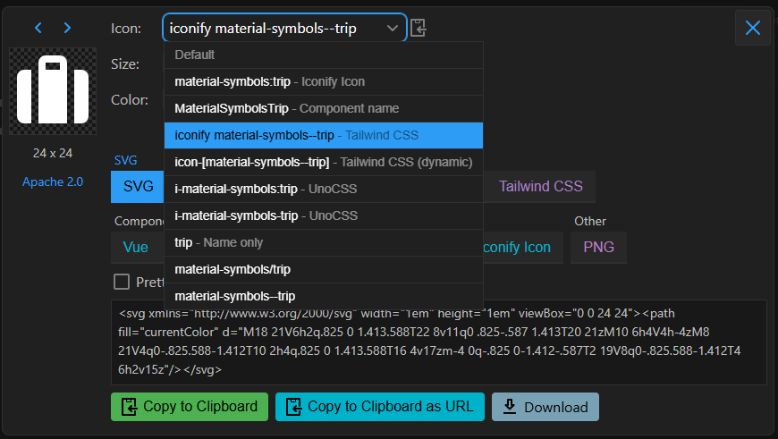

# Overview

The web base is currently using Iconify as its icon library.
Iconify is a versatile icon library that provides multiple ways to load icons. To summarize, you can load icons from:

- Local Server: Host your own icon server and load icons from there.
- Iconify's Icon Server: Use Iconify's own server to load icons, eliminating the need for self-hosting.
- Direct Import: Import icon sets directly, which can be useful for offline or specific use cases,

## Web-base's Iconify Configuration

Our web application has been configured to utilize Tailwind classes for the incorporation of icons, thereby enhancing flexibility and customization capabilities. This implementation enables the utilization of utility classes to render icons, allowing for effortless modification of their appearance and behavior throughout the application.

### Base Configuration

`Web-base` uses the `@iconify/tailwind` plugin, and is preconfigured with 2 Iconify icon sets `mdi` and `mdi-light`.

```json title="package.json"
"devDependencies": {
// ...
// highlight-next-line
"@iconify/tailwind": "^1.1.3"
// ...
}
```

```typescript title="tailwind.config.ts"
import { fontFamily } from "tailwindcss/defaultTheme";
// ...
// highlight-next-line
plugins: [addIconSelectors(["mdi", "mdi-light"]), ...]
```
:::info
For more information on Iconify's plugins, please refer to https://iconify.design/docs/usage/css/tailwind/
:::

### Adding new icon sets to web-base

To add new icon sets, you'll have to install them as dev dependencies. For instance, if you want to use the `Material Symbols` icon set, you need to:

1. Install the `Material Symbols` dev dependency:
```javascript
npm install @iconify-json/material-symbols
```
:::info
the syntax for the icon set dependency is: `@iconify-json/{prefix}`
:::

2. Include the prefix in the `addIconSelectors` plugin.
```javascript
plugins: [addIconSelectors(["mdi", "mdi-light", "material-symbols"]), ...]
```

3. Use the icon from the icon set in your HTML element. For example, if you want to use the material-symbols trip icon:



4. You can then create a `<span>` element and use the class name as per what you see in the screenshot above:

```html
<span class="iconify material-symbols--trip"></span>
```

:::info
For more information on the _addIconSelectors_ plugin, please refer to
https://iconify.design/docs/usage/css/tailwind/iconify/
:::