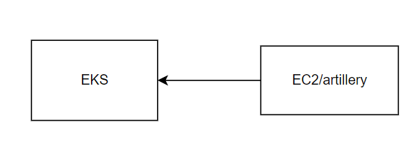

# Loadtesting results

### These are the reference sizing and loadtesting results 
These test are done in AWS eks.

<table>
  <thead>
    <tr>
      <th>Environment </th>
      <th>Setup </th>
      <th>Max Users</th>
      <th>Peak req/s</th>
      <th>Average req/s</th>
      <th>Database type</th>
    </tr>
  </thead>
  <tbody>
    <tr>
      <td >aws</td>
      <td>  8 core, 4 nodes</td>
      <td>50</td>
      <td> 60</td>
      <td> 60</td>
      <td>internal postgres with gp2</td>
    </tr>
    <tr>
      <td >aws</td>
      <td>  8 core, 4 nodes</td>
      <td>250</td>
      <td>38</td>
      <td>215</td>
      <td>Aurora RDS </td>
    </tr>

  </tbody>
</table>

### detail report

#### Setup
environment: aws
Cluster type: EKS
number of nodes: 4
number of cores: 8
Ram: 32gb
number of cores per node: 2
Ram per node: 8gb
Machine type used: t3a.large
Tool used: Artillery/Playwright

Figure 1 Artillery installed in EC2 instance in AWS testing the EKS cluster

In Figure 1, you can see the setup of the tester EC2 instance that was used to test the EKS clusters. Artillery and Playwright were installed in the EC2 instance so that they can run the test script, and they hit the AWS EKS clusters through the internet.

<table>
  <thead>
    <tr>
      <th>Metric </th>
      <th>Value </th>
    </tr>
  </thead>
  <tbody>
    <tr>
      <td >browser.http_requests</td>
      <td>  13811 </td>
    </tr>
    <tr>
      <td >vusers.completed</td>
      <td> 50 </td>
    </tr>
    <tr>
      <td >vusers.created</td>
      <td> 50 </td>
    </tr>
    <tr>
      <td >vusers.created_by_name.0</td>
      <td> 50 </td>
    </tr>
    <tr>
      <td >vusers.failed</td>
      <td> 0 </td>
    </tr>

  </tbody>
</table>

Average Respond time = 548/13811 = 39ms

Figure 2 http request distribution graph

From Figure 2, you can observe that most of the http requests were made on the first 190 seconds of the test. This can be explained with the test steps involved.

#### test steps

1) User go to the log in page of AOH
2) User enters username and password into the respective fields
3) User waits for dashboard to load
4) User go to Incident page
5) User checks that the page is loaded (Add button)
6) User wait for 2 seconds (simulate think time)
7) User go to Trips page
8) User waits for 2 seconds (simulates thini time)
9) User goes back to incident page again
10) the loop goes on for 85 cycles

From the test steps above, you can observe that each user test run will take a minumum time of 340 seconds, assuming the system respond immediately.

