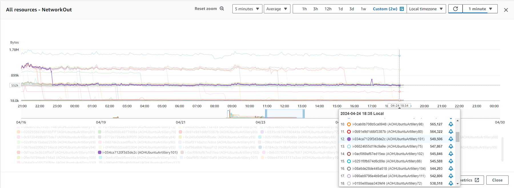
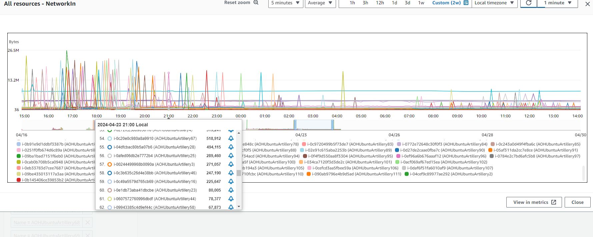
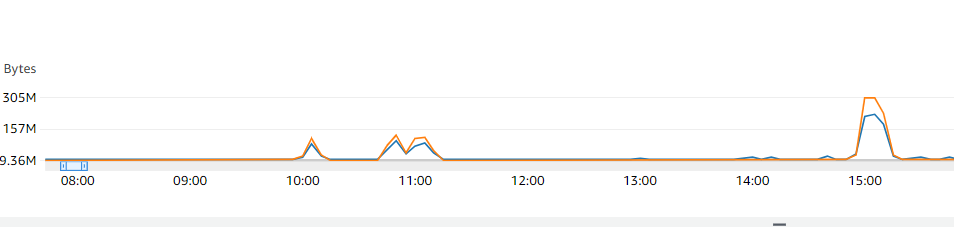

# UCS/SFU Loadtesting 
Objective: 

### AOH Cluster setup used for the test
Environment:                        wfm-qa
Cloud provider:                     AWS
Number of Cores in the AOH cluster: 8
Number of nodes for cluster:        4
Number of cores for SFU:            2
Size of RAM:                        32GB
Storage class:                      gp3

## These are the test setup

### EC2 instances testing machine
Number of Cores: 4
Class of EC2: t3a.xlarge
RAM size: 16GB
EBS class : gp2

### SFU configuration
maxbandwidth = 1500kbps
maxpackettrack = 500

### loadtest targets
Minimum Number of 1-1 video calls: 100
Minimum Number of streams: 200
Minimum Number of Users: 200

#### Additional Tools used:
 OBS (For Webcam simulation)

Websites used for webcam simulation
- https://www.clocktab.com/
- https://www.timeanddate.com/worldclock/
- https://www.changiairport.com/
- https://www.youtube.com/watch?v=LDU_Txk06tM

#### actual communication model

All clients will send their video stream to the SFU, and will receive streams from other uses through the SFU

####

### Test steps
1) EC2 of type t3a.xlarge is spawned
2) Firefox, OBS, webcam simulator stream is installed
3) Webcam simulator is started, OBS is started
3) 1st User insteance is started up and logged in for Firefox, 1-1 video call is engaged with 2nd User
4) 2nd User instance is started up and logged in in Firefox private mode. 1-1 vidoe call is engaged with 4th User
5) Another EC2 is spawned.
6) Firefox, OBS, webcam simulator stream is installed as well
7) 3rd User insteance is started up and logged in for Firefox, 1-1 video call is engaged with 1st User
8) 4th User instance is started up and logged in in Firefox private mode. 1-1 vidoe call is engaged with 2nd User
9) The process is repeated

### results

Figure 1 graph of EC2 with one or two streams output running

From figure 1, you can observe that most EC2s will converge to about 1.58MBps when two streams is up, and around 550kBps when one steam upload is happening.

Figure 2 graph of EC2 with one or two streams input running

From figure 2, you can observe that the EC2s are also ingesting the streams at about the same bandwith. 

From Figure 2, you can observe that more tha 55 EC2s have bandwidth ingesion running at 1.1Mbps, which indicates that there are two streams running. It also means that there are at least 110 streams being ingested at the same time.

### observation
1) Most stream stays around 600kB  
2) streams drop/disconnects  after a while, there seems not to be any notable pattern at this point of time for the disconnections
3) there will be typically 2 drops that will be happening. After the 2nd drop, the EC2 does not seem to be streaming any data until the UCS front end is restarted 
4) It seems that the SFU likes to converge to CPU 34%

#### some statistic
1) Maximum bitrate recorded = 63kbps
2) Max UDP byte process per seconds handled by SFU (up/down): 562kbps
3) Max CPU utilisaton for sfu pod/service: 50%
4) Max Memory utilitsation for sfu pod/service: 14%
5) Max Node CPU utilisation: 63.4%
6) Average Node memory utilisation: 51%

## Appendix A OBS as a virtual webcam

Apart from steaming a PC screen to major streaming sites,  OBS can emulate a webcam onto the client using the many source capture tools the OBS offers. For this test, the browser capture tool allows a user to load a webpage directly. 

## Appendix B why Spawn EC2 instance instead of spawing VMs on local servers
The bandwidth of the office to the wfm-qa environment is 99mbps. To prevent any bottle neck, it was decided to do future tests in the EC2 when possible.

Sample max network activity of 305 MBps recorded