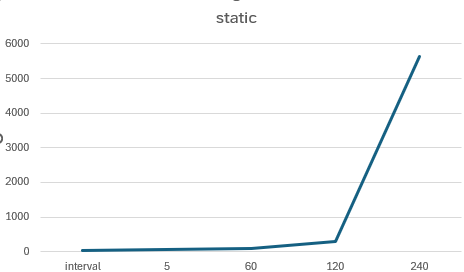

# RnR Web Client loading Loadtesting 

### Objective: To test the Number of Users supported  with respect to the sizing of the Replay-web pods

### Main Parameter to measurea
- Users

## #Results

<table>
  <thead>
    <tr>
      <th>pod number </th>
      <th>CPU size </th>
      <th>Ram size</th>
      <th>Users supported</th>
    </tr>
  </thead>
  <tbody>
    <tr>
      <td >1</td>
      <td> 200m</td>
      <td>128MB</td>
      <td> 3</td>
    </tr>
    <tr>
      <td >2</td>
      <td>  200m</td>
      <td>128MB</td>
      <td>4</td>
    </tr>
	<tr>
      <td >3</td>
      <td>  200m</td>
      <td>128MB</td>
      <td>6</td>
    </tr>
    <tr>
      <td >4/td>
      <td>200m</td>
      <td>128MB</td>
      <td>7</td>
    </tr>
    <tr>
      <td >1 </td>
      <td>200m</td>
      <td>2056MB</td>
      <td>3</td>
    </tr>

  </tbody>
</table>

### 1 Testing setup

### AOH Cluster setup used for the test

- Environment:                        	qa
- Cloud provider:                     	AWS
- Number of Cores in the AOH cluster: 	6
- Number of nodes for cluster:        	3
- Size of RAM per cluster:            	24GB
- Size of RAM pre node:               	8GB
- Storage class:                     	gp2
- CPU limit per pod			200M
- RAM limit per pod			128MB

## These are the test setup

### 2 Testing Preparation
1) The snapshot interval is changed to the required timing based on the test plan
2)  For some interval, trips are added by a cyclic script which hammers the system at a rate of 29 seconds per trip.

---
3 Test steps
---
<!-- Chapter content here -->

### 
1) A timing close to the time interval is chosen
2) After activating the dev-mode, start to record the network traffic
3) load the session.

---
3 Findings
---
Replay web is behaving like the normal web in terms of maximum user login per seconds.

Average request per log in  = 156req

max request per seconds = 636

max supported user per seconds login = 4 (dev2)

Max user supported for replay is therefore = 4
