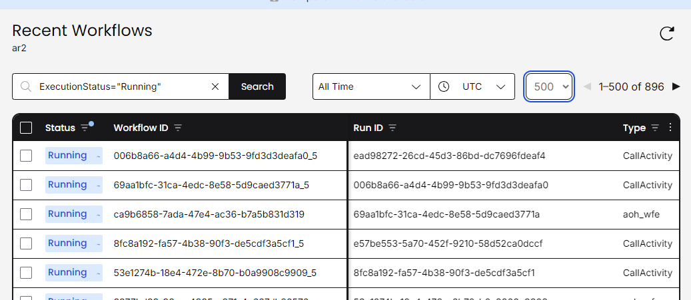
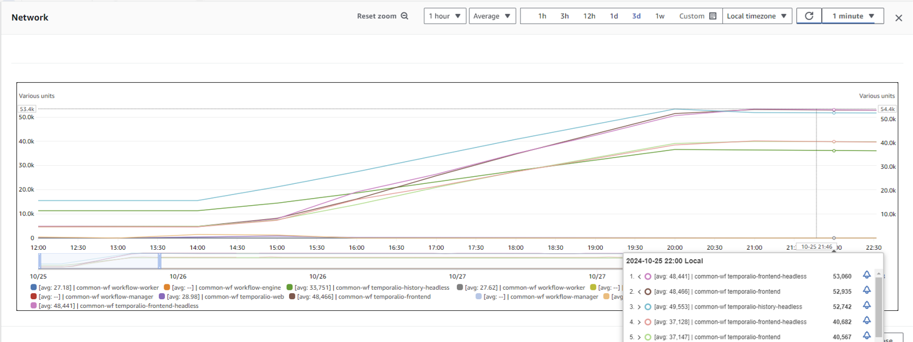

# WFE Loadtesting 

### Objective: To stress test the Workflow engine 

### loadtest Objective
To see how much the cluster/node CPU and RAM increase with a set of workflow loaded and running in the system

---
1 Testing setup
---

### AOH Cluster setup used for the test
Environment:                        qa
Cloud provider:                     AWS
Number of Cores in the AOH cluster: 14
Number of nodes for cluster:        7
Number of cores per node:           2
Size of RAM per cluster:            56GB
Size of RAM pre node:               8GB
Storage class:                      gp3 - 3000iops

## These are the test results

Number of workflow spawned: 896
Increase in CPU utilisaton: 2.4%
Increase in RAM usage: 0.7 - 0.82%

