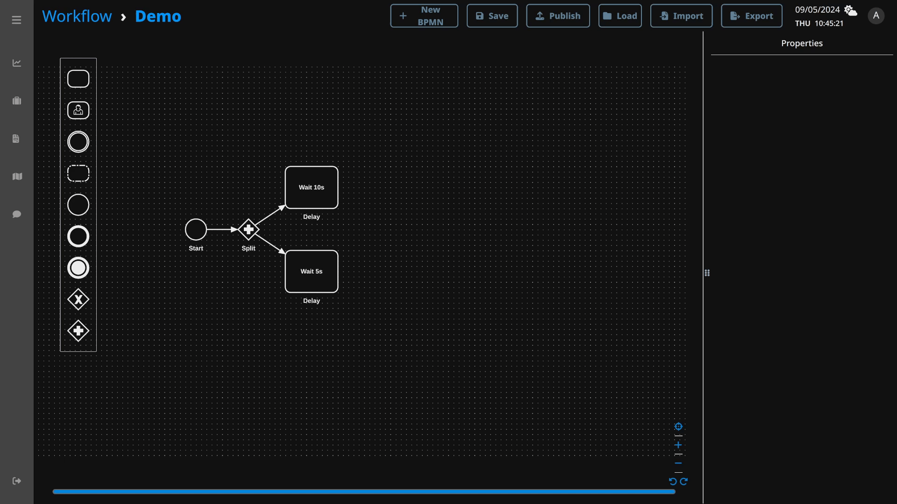
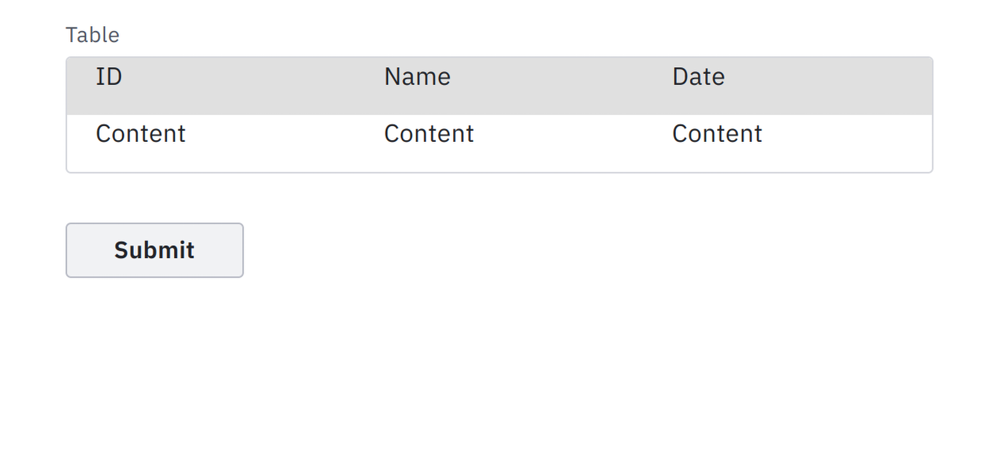
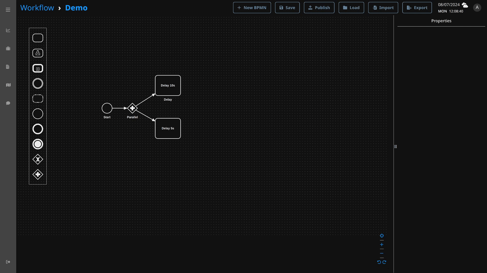

# Workflow Designer

Web diagramming application allows users to design and collaborate in the creation of ESOP workflows.

## Menu Bar


| Button   | Description                                    |
|----------|------------------------------------------------|
| New BPMN | Create new canvas                              |
| Save     | Save current BPMN                              |
| Publish  | Publish BPMN (published BPMN cannot be edited) |
| Load     | Load saved or published BPMN                   |
| Import   | Import BPMN from local drive                   |
| Export   | Export BPMN into local drive                   |


## Simple Workflow
Let's build a simple workflow by below steps:
- Drag and drop BPMN elements from the palette onto the canvas
- Assign the element properties by clicking on it to reveal the properties panel on the right side
- Click on the save button to save it


## Expression Language
Expression Language (`expr`) is used in workflow designer to manipulate with workflow data.
To try out `expr`, visit their [playground](https://expr-lang.org/playground).

### Access Workflow Data
When the activity is completed, it stored its output in workflow data. To access its value, simply retrieve the value by
variable name using expression

Example, Activity return the result `101` and store the value in workflow data variable named `Result_Activity`. If
you want to access its value in next activity, use below expression to get value `101`.


### Extract Workflow Data
If the activity output is in complex JSON object, you can still retrieve specific value by using membership operators.

Example json output
```json
{
    "users": [
        {
            "name": "Alice",
            "age": 41
        },
        {
            "name": "Bob",
            "age": 29
        }
    ]
}
```

Below expression use membership operator `[]` & `.` to retrieve first element `age` value `41` in `users` object


### Conditional Statement
Use expression language to construct conditional statement. Refer to [switch](#switch) gateway.

## Gateways
### Parallel

#### Splitting
A splitting parallel gateway executes multiple activities in parallel creating multiple sequence flows.


#### Merging
A merging parallel gateway waits until all the incoming sequence flows are completed before moving on to the next steps.



### Switch
A switch is an exclusive gateway which will only proceed when the condition defined inside the flow is true.
If there are conflicting conditions, the lowest flow order number will take precedence over others.


## Form
Form templates which are generated by [Form Designer](form_designer.md) can be used as user input activities in workflow.
When the user submit the form, form activities will return the submitted data in JSON object.


### Input Data Binding
When input fields data are bound, input field value will be autofilled with bound 
data during the workflow execution.

Supported input fields that can be bound are
- Text field
- Text area
- Number
- Date time

Date time has three subtypes. When binding data time, make sure to use correct format otherwise data will not be bound.

| type        | format              | example                |
|-------------|---------------------|------------------------|
| Date        | YYYY-MM-DD          | 2024-01-31             |
| Time        | hh:mmTZD            | 12:45+08:00            |
| Date & Time | YYYY-MM-DDThh:mmTZD | 2024-01-31T12:45+08:00 |

Below example demonstrates binding of activity outputs into form input field `keys`.


Executing the above workflow will render the form with prefilled input fields.

<table>
<thead><tr><th>Before</th><th>After</th></tr></thead>
<tbody>
<tr><td>


</td><td>


</td></tr>
</tbody></table>

### Selection Data Binding
To bind a selection field options, binding data value must be a list of string. Except for check box, which only 
have one item and can be bound with boolean.

List of selection fields:
- Checkbox
- Checkbox group
- Radio group
- Select
- Tag list

Example workflow of binding form selection fields with array of string in JSON object using expression language.


Running above workflow will yield below form with auto populated selection options. `Select` and `Tag list` will 
show options when user click on it.

<table>
<thead><tr><th>Before</th><th>After</th></tr></thead>
<tbody>
<tr><td>


</td><td>


</td></tr>
</tbody></table>

### Table Data Binding
Binding the table data means populating the table rows with bound column name. Column name of the table should be 
defined in form template first. To bind table, pass a json object with table column names as keys in json object 
properties.

For example:


<table>
<thead><tr><th>Before</th><th>After</th></tr></thead>
<tbody>
<tr><td>



</td><td>


</td></tr>
</tbody></table>


## Event
An event is something that happens during the workflow execution.

## Timer Event
Timer event are triggered by a defined timer. Workflow studio comes with built-in `timer` event type which duration is
configured using ISO 8601 duration format. (eg. `PT30S` means 30 second duration) 


### Intermediate
Intermediate events are drawn between two processes.


### Boundary
Boundary events can be either interrupting or non-interrupting.
Interrupting events will cancel the host activity and other boundary events attached to the host.


### Terminate
When a terminate event is raised, workflow will attempt to terminate all ongoing processes immediately.



Below scenarios can occur if the workflow is terminated by terminate event
- ongoing activities are interrupted first before workflow itself is terminated
- ongoing activities are completed instead before workflow itself is terminated due to slower processing

## CallActivity
CallActivity can execute another workflow and store its output inside the result variable.


