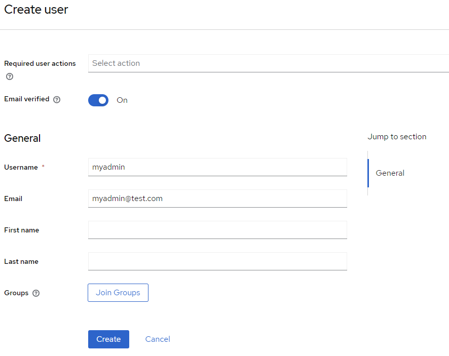
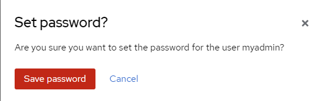

# Setup System Administrator Account

The system administrator is the administrator that has the right to administer tenant and tenant membership.

1.	Open browser and access the `Keycloak Admin Console` by using the URL configured in `KC_HOSTNAME`.

2.	Login to the `Keycloak Admin Console` using the username and password pair configured in `KEYCLOAK_ADMIN` and `KEYCLOAK_ADMIN_PASSWORD`.

The default admin username is `admin` and password is `admin`. 

3.	After login, switch to the default realm. The default name of the default realm is `AOH`.

4.	Next, click on the `Users`menu item in the side menu.

5.	Click on `Add user` button.

6.	In the `Create user` form, enter the followings:

* Email verified – set to On
* Username – the desired username of the system administrator. In the example below, myadmin is used.
* Email – the email of the system administrator
 

7.	Click on `Create` button to create the user.

8.	Click on `Credentials` tab.

 

9.	Click on `Set password` button.

10.	Enter the desired password for the administrator and turn off `Temporary`

 

11.	Click `Save` button, follow by `Save password` button.

 
  

12.	Next, click on `Role mapping` tab.
 
  

13.	Click on `Assign role` button

 
  
 

14.	Click `Filter by realm roles` from the filter dropdown.
 
 
  

15.	From the list of roles shown, check on `system-admin` role and click `Assign`.

 
   

