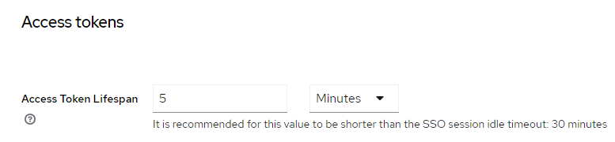

# ID Token, Access Token, and Refresh Token

As mentioned above, after user successful login to Keycloak, Keycloak will redirect user back to Web App Backend with authorization code which Web App Backend can use to exchange for `ID Token`, `Access Token`, and `Refresh Token`.
All the tokens returned by Keycloak are `JWT` tokens. A `JSON Web Token` (JWT) is a standard that defines a compact and secure way of transmitting data along with a signature between two parties. A JWT can contain any information in JSON form, also known as JWT claims. Typically, JWTs have an expiration time or exp claim, ensuring that they’re valid for a particular duration.

## ID Token

OpenID Connect always issues `ID tokens` along with `access tokens` to provide compatibility with `OAuth` and match the general tendency for authorizing identity.

`ID token` carries personal information about end-users that authenticate on an OpenID Connect flow. In addition, this security token contains claims data about the user as saved with Keycloak.

The `ID token` is used to retrieve the user’s basic profile information like name, username, and email, which is present in the Keycloak. 

::: caution
`ID token` should **not** be used to gain access to backend APIs.
:::

##	Access Token

`Access tokens` are credentials used to access protected resources (i.e., backend APIs).

`Access tokens` are used as `bearer` tokens. A bearer token means that the bearer (who holds the access token) can access authorized resources without further identification.

Because of this, it is important that bearer tokens be protected. 

These tokens usually have a short lifespan for security purposes. Typical lifespan is 5 minutes.

The lifespan can be change under the `Realm setting` > `Tokens` page in Keycloak Web Admin Console. 
 


When it expires, the new access token must be requested from Keycloak, either through authenticate again or using refresh token, which help to limit the exposure of the fact that it is a bearer token.

An access token is put in the Authorization header of the HTTP request to the backend API, it should be in the following format to ensure that the API that you are calling can verify it:
`Bearer <access_token>`

AGIL Ops Hub Web Framework has the mechanism to auto refresh the access token before it expires to minimize authorization error when invoking backend APIs.

##	Refresh Token

This token is a long-lived token compared to the access token and is used to request a new access token in cases where it has expired. Hence, it can be considered as credentials used to obtain access tokens.

Typical lifespan of refresh token is typically `30` minutes and the expiry time will get extended every time it is used to refresh the access token. However, it will not be extended beyond the SSO Session Max timing which typically set to `10` hours.

The lifespan of refresh token is configured in `Realm setting` > `Sessions page`, under the `SSO Session Idle` and `SSO Session Max fields`.
 
The refresh token allows a new access token to be requested without needing the user to re-authenticate, thereby providing a seamless user experience.


##	Validate Access Token

As mentioned, Access Tokens are credentials used to access protected resources such as backend APIs. Hence, when received an Access Token alone with the request, the backend application will need to validate the Access Token and reject all requests with invalid or missing tokens.

There are 2 ways to validate the Access Token:
*	Online validation
*	Offline validation


### Online Validation

The simplest way to perform online validation is to invoke the Keycloak’s Userinfo endpoint at:

``` bash
http(s)://<keycloak URL> /realms/<realm-name>/protocol/openid-connect/userinfo
```

where `<keycloak URL>` is the URL to the Keycloak server and `<realm-name>` is the name of the realm.

In the HTTP request, you need to pass the access token in the Authorization header. Below is an example of access that endpoint using postman:


If the access token is valid, the endpoint will return the HTTP status `200` and if the access token is invalid, the endpoint will return HTTP status `401`. 

::: Note
some literature will advise using the Token Introspect Endpoint to validate the token instead. However, do note that this endpoint can only be invoked by confidential clients. I.e., you will need to pass the client id and client secret as part of the request. 
:::

###	Offline Validation

Alternative to online validation is to do offline validation which is more efficient as it doesn’t introduce another http/round trip for every validation.

To offline validate access token, you need to perform the following steps:
*	Split the access token into its sections
*	Validate the signature of the access token
*	Check the issue date and expiry date in the token’s claims

####	Split Access Token into Sections

As mentioned, access token is a standard JWT token which consists of the following sections:
*	Header
*	Payload (often referred to as body)
*	Signature

Sections are represented as base64url-encoded strings separated by a period (‘.’) delimiter. So, the first steps to validate the access token to split it into the 3 sections. 

The following is a Java code snippet to split the access token into 3 sections:

``` bash
String accessToken ='<access token string>';
String [] parts = accessToken.split ("\\.");
```

####	Validate the Signature

Next, we need to verify the integrity of the header and payload to ensure that they have not been altered by using the signature section.

To begin verifying the payload and header, we need both the signature algorithm that was used originally to sign the token and the secret key. For Keycloak:
*	Signature algorithm is by default RS256
*	Secret Key is the public key of the realm, which can be obtains from the following endpoint:

``` bash
http(s)://<keycloak server URL>/realms/<realm name>
```

You should obtains respond similar to the followings with the public key in the `public_key` field:

```bash
{
  "realm": "AOH",
  "public_key": "MIIBIjANBgkqhkiG9w0BAQEFAAOCAQ8AMIIBCgKCAQEA7IaYbebl3fQ5ZaZBMlMe1kaTeVK0rfnn02bVWbHVudP0S513RdufxqosmKH0r/+QhXpZjfeEUfVrzKMe/NqJiVSv158gbPwX8ovqDTrPl/OEfROgvzMa+DM7HZxz9l1dSmPyXaG5TIl0CLLKibzDupp66/AuUluk4Z2fvBwujrJIQds6URGoVXhDqR136tqomgKU7UIB0dSgLK5ftO4SjPDRfij9+QNyyjF/kzTGqQmxeFEotmQrsGpGJPY7vYgHnlkSwLC7KM5JZwKex8uk6dVAOkM50rh3WxHIabH7h6m3Y5KpNVI/iS1e3clyaiE0iL1WCyByK2lXjVPjnSTQrwIDAQAB",
  "token-service": "http://iams-keycloak.10.10.10.100.nip.io/realms/AOH/protocol/openid-connect",
  "account-service": "http://iams-keycloak.10.10.10.100.nip.io/realms/AOH/account",
  "tokens-not-before": 0
}
```

The following is a Java code snippet using the Java JWT library from `Auth0` to validate the signature:

``` bash
byte [] keyBytes = Base64.getDecoder().decode(JWTConstants.KEYCLOAK_PUBLIC_KEY);
X509EncodedKeySpec encodedKeySpec = new X509EncodedKeySpec(keyBytes);
KeyFactory factory = KeyFactory.getInstance("RSA");
PublicKey pk = factory.generatePublic(encodedKeySpec);
Algorithm algorithm = Algorithm.RSA256((RSAPublicKey) pk, null);
JWTVerifier verifier = JWT.require(algorithm).ignoreIssuedAt().build();
       
try {
verifier.verify(accessToken);
            return true;
}
catch (JWTVerificationException e) {
System.err.println(e);
            return false;
}
```

####	Check Issue Date and Expiry Date

Finally, after determine that the signature of the access token is valid, the next step is to check that the access token not expired. To do that, you need to:
*	Decode the payload of access token
*	Check that the value of `exp` doesn’t exceed current timestamp

The payload of the access token is encoded in base64. 

The following is a Java code snippet show how to decode the payload of the access token:

``` bash
String[] parts = accessToken.split("\\.");
String decodedAccessToken  = new String(Base64.getUrlDecoder().decode(parts[1]));
```

After decoded the access token, you should get a JSON string with structure similar to the followings:

``` bash
{
  "exp" : 1725001351,
  "iat" : 1725001051,
  "jti" : "6087d61c-a81a-491c-b2e5-000643bfc3aa",
  "iss" : "http://iams-keycloak.10.10.10.100.nip.io/realms/AOH",
  "aud" : [ "realm-management", "account" ],
  "sub" : "b6a62a0e-ab9f-4369-bc75-3e8bd2b5ddbb",
  "typ" : "Bearer",
  "azp" : "web-app",
  "sid" : "e162ab8f-2f9c-461c-8c42-a713e7572cdb",
  "acr" : "1",
  "allowed-origins" : [ "http://localhost:3000" ],
  "realm_access" : {
    "roles" : [ "system-admin", "default-roles-aoh", "offline_access", "realm-tenant-admin", "uma_authorization" ]
  },
  …
}
```

The value in the exp field is a JSON `NumericDate`, which is the number of seconds (not milliseconds) since Epoch (1970-01-01T00:00:00Z UTC).

The following Java code snippet show how to check whether the value of `exp` exceed current time:

``` bash
JsonNode payload = mapper.readTree (decodedAccessToken);
if (payload.get("exp").asLong() < (System.currentTimeMillis() / 1000) ) {
	System.out.println("Not Expired.");
}
```
