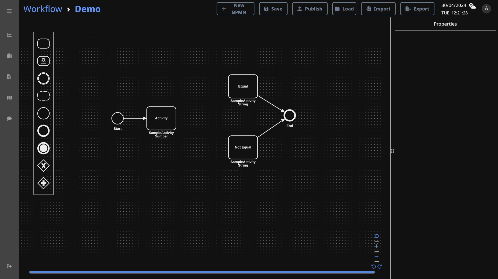
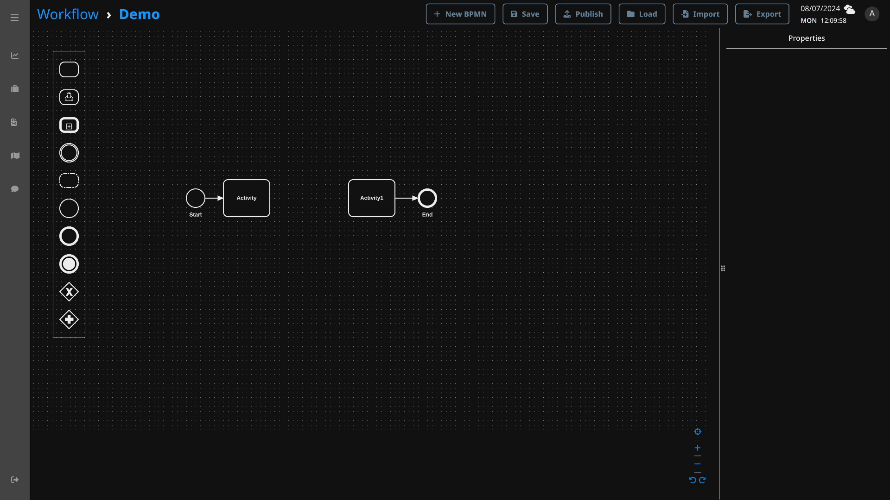

# Workflow Designer

Web diagramming application allows users to design and collaborate in the creation of ESOP workflows.

## Menu Bar

| Button   | Description                                    |
|----------|------------------------------------------------|
| New BPMN | Create new canvas                              |
| Save     | Save current BPMN                              |
| Publish  | Publish BPMN (published BPMN cannot be edited) |
| Load     | Load saved or published BPMN                   |
| Import   | Import BPMN from local drive                   |
| Export   | Export BPMN into local drive                   |

## Simple Workflow
Let's build a simple workflow by below steps:
- Drag and drop BPMN elements from the palette onto the canvas
- Assign the element properties by clicking on it to reveal the properties panel on the right side
- Click on the save button to save it

## Data Flow
Activity that returns data will be assigned to its result variable name which can be further utilized in subsequent activities or gateways.

## Gateways
### Parallel

#### Splitting
A splitting parallel gateway executes multiple activities in parallel creating multiple sequence flows.

#### Merging
A merging parallel gateway waits until all the incoming sequence flows are completed before moving on to the next steps.

### Switch
A switch is an exclusive gateway which will only proceed when the condition defined inside the flow is true.
If there are conflicting conditions, the lowest flow order number will take precedence over others.

## Form
Form templates which are generated by [Form Designer](form_designer.md) can be used as user input activities in workflow.
When the user submit the form, form activities will return the submitted data in JSON object.

To access the value of the form input, use the switch-flow advance mode tab and access them by their form components key.

## Event
An event is something that happens during the workflow execution.

### Intermediate
Intermediate events are drawn between two processes.

### Boundary
Boundary events can be either interrupting or non-interrupting.
Interrupting events will cancel the host activity and other boundary events attached to the host.

### Terminate
When a terminate event is raised, workflow will attempt to terminate all ongoing processes immediately.
However, ongoing processes may be completed instead if the workflow terminate execution is slower.

## CallActivity
CallActivity can execute another workflow and store its output inside the result variable.

