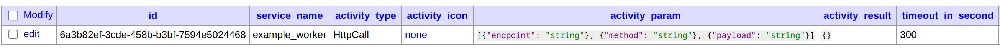

# Activity

An Activity is a normal function or method that executes a single, well-defined action (either short or long-running), 
such as calling another service, transcoding a media file, or sending an email message. Activity code should be 
deterministic.

It is highly recommended to read the [Official Activity Documentation](https://docs.temporal.io/activities) from 
Temporal.

## Activity Sample

Before we start writing our own activity, let's take a look at the sample activity implementation to get a better
understanding of how it works.

Follow the steps below to run the sample `helloworld` activity:
1. First clone the repository
```bash
git clone https://github.com/mssfoobar/wfe_activity
```

2. Go to the `sample/helloworld` folder
```bash
cd sample/helloworld
```

3. Run the worker and let it run
```bash
go run worker/main.go
```

4. Run the starter in another terminal. You will see the following output
```bash
go run starter/main.go
2024/11/03 20:38:30 INFO  No logger configured for temporal client. Created default one.
2024/11/03 20:38:30 Started workflow WorkflowID hello_world_workflowID RunID 11274584-4776-448e-b301-f9b8649e4cac
2024/11/03 20:38:30 Workflow result: HelloWorld! Hi!
```

5. Visit the Temporal web ui at `http://localhost:8080` to see the sample activity in action.

If you look at the activity code in `helloworld/activity.go`, you will see that it is a simple method with
Activities receiver that returns "Hello World!" with additional input as an argument.
```go
type Activities struct{}

func (a *Activities) HelloWorld(ctx context.Context, input string) (string, error) {
    return "HelloWorld! " + input, nil
}
```

Inside the `helloworld/workflow.go`, you will see how to call the activity inside the workflow. Here we call the
`HelloWorld` activity with an input of `Hi`.
```go
// Workflow is a workflow definition.
func Workflow(ctx workflow.Context) (string, error) {
    ao := workflow.ActivityOptions{
    StartToCloseTimeout: 10 * time.Second,
    }
    ctx = workflow.WithActivityOptions(ctx, ao)
    
    logger := workflow.GetLogger(ctx)
    logger.Info("Workflow started")
    
    var result string
    var activities Activities
    // here call your activity with arguments
    err := workflow.ExecuteActivity(ctx, activities.HelloWorld, "Hi!").Get(ctx, &result)
    if err != nil {
    logger.Error("Activity failed.", "Error", err)
    return "", err
    }
    
    logger.Info("Workflow completed.", "result", result)
    
    return result, nil
}
```

:::tip
Using this sample activity, you can quickly write your own activity and call it inside workflow definition as shown
above.
:::

## Activity Development

1. Create a new repository using the [Activity Template](https://github.com/mssfoobar/wfe_activity)

2. Write your own activity inside the `internal/worker/activities` folder
```go
type Activities struct{}

// Add your own activities here with Activities as the receiver
// 
// for example
// func (a *Activities) ActivityName(ctx context.Context, input string) (string, error) {
// }
```

3. After writing your own activity, you can build an image using the docker build command. Your GitHub personal
   access token must have the `read:packages` scope to download private AOH packages.
```
docker build --build-arg GITHUB_PAT={YOUR_GITHUB_PAT} -f ./docker/worker.Dockerfile .
```

## Cancellable Activities

If you want your activity to be cancellable, you need to heartbeat at regular interval.
Below is an example HttpCall activity. Note that before and after executing long-running processes, it will
heart beat with `activity.RecordHeartbeat(ctx, "status-report-to-workflow")` and catch cancellation from the workflow
by checking `ctx.Done()`.
```go
// HttpCall take in 'method', 'endpoint' and 'payload' as input
// Successful execution return http response
func (a *Activities) HttpCall(ctx context.Context, endpoint, method, payload string) (interface{}, error) {
    client := &http.Client{}
    req, err := http.NewRequest(method, endpoint, bytes.NewReader([]byte(payload)))
    if err != nil {
    return nil, err
    }
    
    // heartbeat report before long-running process
    activity.RecordHeartbeat(ctx, "status-report-to-workflow")
    
    res, err := client.Do(req)
    if err != nil {
    return nil, err
    }

    // heartbeat report after long-running process
    activity.RecordHeartbeat(ctx, "status-report-to-workflow")
    
    body, err := io.ReadAll(res.Body)
    if err != nil {
    return nil, err
    }
    defer func() {
    _ = res.Body.Close()
    }()
    
    var result interface{}
    if err := json.Unmarshal(body, &result); err != nil {
    return nil, err
    }
    
    // catch cancellation from workflow by checking ctx.Done
    select {
    case <-ctx.Done():
    return nil, ctx.Err()
    default:
    }
    
    return result, nil
}
```

## Activity Integration with Workflow Designer

Workflow Designer doesn't have visibility of the activities registered in the Temporal server. To make Workflow
Designer show the activities, you need to insert the rows representing the activities function declarations in the
database. Using the same `HttpCall` example, its record inside the `service_activity` table will look like this:



- `service_name` - the name of the service where the activity is registered. this should be the name of the container
- `activity_type` - the name of the activity function
- `activity_icon` - the icon of the activity. set this to `none` as this feature is not supported yet
- `activity_param` - the parameter of the activity. must be the same as the function argument. here `endpoint`, `method`
  and `payload` are the arguments of the `HttpCall` activity. ordering must be the same as function arguments.
- `activity_result` - the data type of the activity result. here `{}` for json object
- `timeout_in_seconds` - the timeout of the activity in seconds
