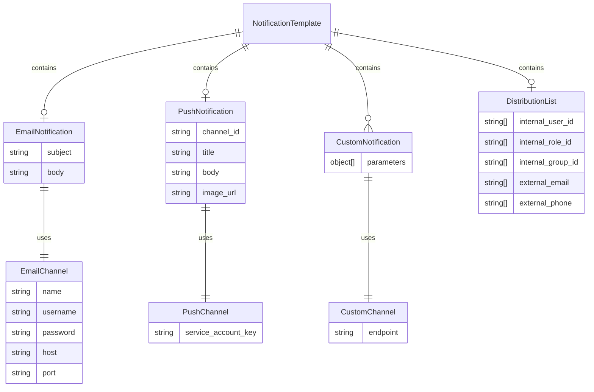

# Entity Relationship

- Notification Template has
  - Email Notification which uses email channel (SMTP server) to send email notifications to recipients' email addresses
  - Push Notification which uses push channel (FCM server) to send push notifications to recipients' mobile devices
  - Custom Notification which uses customized channel (developer defined channel) to send customized notifications
  - Distribution List which contains list of recipients internally (AOH IAMS users) and externally