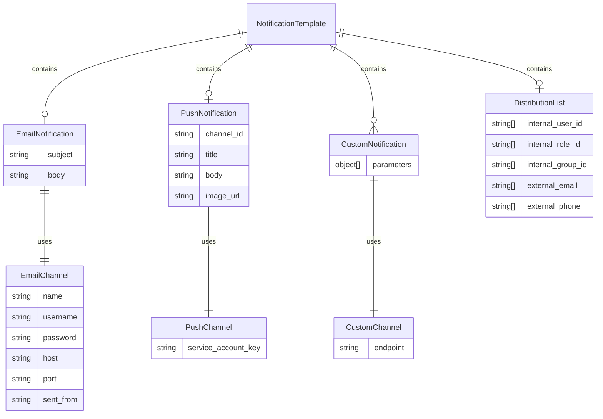

# Entity Relationship

- Notification Template has
  - Email Notification which uses the email channel (via an SMTP server) to send email notifications to recipients' 
    email addresses
  - Push Notification which uses the push channel (via an FCM server) to send push notifications to recipients' mobile 
    devices
  - Custom Notification which send notifications through developer-defined custom channel, allowing for customized 
    delivery methods
  - Distribution List which contains a list of recipients both internally (AOH IAMS users) and externally to send 
    notifications to multiple users at once