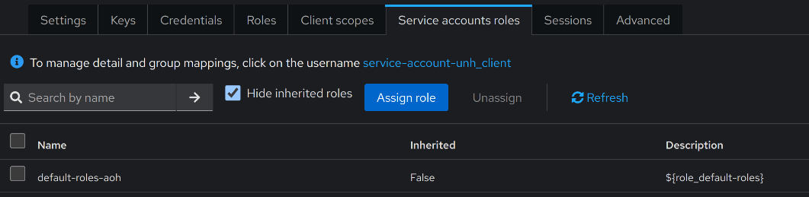

# Prerequisite

- [k3s](https://docs.k3s.io/quick-start)
- [kubectl](https://kubernetes.io/docs/tasks/tools)
- [psql](https://www.timescale.com/blog/how-to-install-psql-on-mac-ubuntu-debian-windows)
- AOH-IAMS
  - [postgreSQL](https://mssfoobar.github.io/docs/docs/modules/iams/quick_start/deploy_postgresql)
  - [IAMS-Keycloak](https://mssfoobar.github.io/docs/docs/modules/iams/quick_start/deploy_iams_keycloak)
  - [IAMS-AAS](https://mssfoobar.github.io/docs/docs/modules/iams/quick_start/deploy_iams_aas)

# UNH Dependencies

UNH is tightly coupled with AOH-IAMS to resolve the recipient contact information such as email & fcm 
token by keycloak user id. Please make sure that you have necessary resources created in AOH-IAMS before proceeding 
with UNH.

Necessary resources needed for UNH
- keycloak client for UNH to call IAMS-AAS API
- keycloak user with email and fcm token attributes

:::important
It is important that you are familiar with IAMS before starting with UNH.
Please refer to IAMS [docs](https://mssfoobar.github.io/docs/docs/modules/iams/introduction) for more information.
:::
 
## Keycloak client for UNH to call IAMS-AAS API

Once you have AOH-IAMS deployed in your kubernetes cluster, you should be able to visit its admin console to create a 
new client.

1. Login to Keycloak Admin Console and switch the realm. This example demonstrates using AOH realm.

2. Click on `Clients` in the side menu and click on `Create client` button.

3. Go through the steps below to create a new client.
    - Fill up the required fields (you may enter your own value here)

    - Set capabilities settings

    - Leave empty for below fields and click on `Save`.

4. Click on `Service accounts roles` tab and click on `Assign role`.

5. Assign `sys-admin` role to the client by choosing `Filter by realm roles` at the top left.

6. You have created a new client in AOH-IAMS. Go to the `Credentials` tab in the client details page and take note of 
the client id and client secret which will be needed in UNH deployment.

## Keycloak user with email and fcm token attributes

:::note
Generating FCM token is out of scope of UNH. So if you don't know how to generate FCM token, you can skip step 1 and 2.
However, if you do, you won't be able to test push notification. If you want to learn more about how to generate a fcm 
token from a mobile device, please refer to 
[google fcm guide.](https://firebase.google.com/docs/cloud-messaging/android/client)
:::

By default, keycloak doesn't come with the fcm token attribute configure in the user profile. We need to add the fcm token 
attribute for UNH to get users' mobile fcm token to send push notification.

1. Click on `Realm Settings` in the side menu and click on `User profile`.

2. Follow the settings below to create a fcm token attribute.

3. Once fcm token attribute is created, we can set the both email and fcm token attributes when we create a new user.
Click on `Users` in the side menu and click on `Create new user`. Make sure to use real working email address and fcm token.

