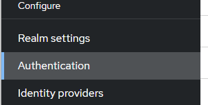

#	Required Action

Required actions in Keycloak are actions a user must perform during the authentication process. A user will not be able to complete the authentication process until these actions are complete.

IAMS added the `Select active tenant` required action to keycloak and it need to be enabled for IAMS to work properly.

If users are member of more than one tenant, this required action will display a form to prompt them to select an active tenant when they login in.

If users are only member of one tenant, this required action will automatically select that tenant as the active tenant without prompting user to select.

## Enable Select Active Tenant Required Action

The steps to enable the required action is as follows:

1.	Login to the Keycloak Web Console.

2.	Switch to the realm if not already there.

  

3.	Click on `Authentication` in the side menu.

  

4.	Click on the `Required actions` tab.
 
  

5.	Toggle the `Select active tenant` required action to `On`.

