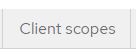
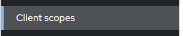
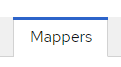
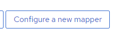
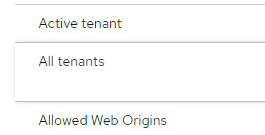

# Token Claims

In order to use information about tenants in your application, you need to add it to the token claims.

IAMS introduced the following mapper to add tenant information to the token claim:

* Active tenant – maps the active tenant to a token claim.
* All tenants – maps all tenants that user is a member of to a token claim.

## Configure the Mapper

You can enable the mapper to the individual client or at the Client Scopes.

If you enable the mapper at the Client Scopes, any new client created after that will inherit the mappers and do not need require further configuration.

The default realm created in the [Quick Start](../02_quick_start/0_overview.md) has the mapper configured in Client Scopes. 

###	Enable at Keycloak Client

To enable the 2 mapper for a Keycloak Client, perform the following steps:

1.	Login to `Keycloak Admin Console` and switch to the realm.

2.	Click on `Clients` in the side menu
 
   

3.	Click on the Client ID of the client to configure.

4.	Click on the `Client scopes` tab.

   
 

5.	Click on the client scope with the name ended with `dedicated`. 

  
 

6.	Click on `Add mapper` and `select By configuration`.

  
 

7.	Click on `Active tenant`

 
 

8.	Enter the following fields:

* Name: 			active_tenant
* Token Claim Name: 	active_tenant
* Turn on `Add to lightweight access token` checkbox

9.	Click on `Save` to add the mapper.

 
 

10.	Click `Cancel` to go back to the Mappers list. You should see `active_tenant` mapper in the list.

 

 
11.	Click on `Add mapper` and select `By configuration`.

12.	Click on `All tenants`

 
 

13.	Enter the following fields:

* Name: 			all_tenants
* Token Claim Name: 	all_tenants
* Turn on Add to lightweight access token checkbox

14.	Click on `Save` to add the mapper.

###	Enable at Client Scopes

As mentioned, enable the mappers in `Client Scopes` will allow any newly created client to automatically inherit the mappers.

Follows the following steps to enable mapper at the Client Scopes:

1.	Login to the Web Admin Console and navigate to the realm.

2.	Click on `Client scopes` in the side menu:

3.	Click on `Create client scope`:
 
 

4.	Enter the followings:
* Name:		any prefer name
* Type:		Default
* Protocol:	OpenID Connect
* Turn off the Display on consent screen checkbox

5.	Click on `Save` to create the client scope.

 
 

6.	Click on `Mappers` tab

 

7.	Click on `Configure a new mapper` button:

 

 
8.	Click on `Active tenant`

 
 

9.	Enter the following fields:

* Name: 			active_tenant
* Token Claim Name: 	active_tenant
* Turn on `Add to lightweight access token` checkbox

10.	Click on `Save` to add the mapper.

 
 

11.	Click `Cancel` to go back to the Mappers list. You should see `active_tenant mapper` in the list.

 

 
12.	Click on `Add mapper` and select `By configuration`.
 

 

13.	Click on `All tenants`

 

14.	Enter the following fields:
*	Name: 			all_tenants
*	Token Claim Name: 	all_tenants
*	Turn on `Add to lightweight access token` checkbox

15.	Click on `Save` to add the mapper.

 

