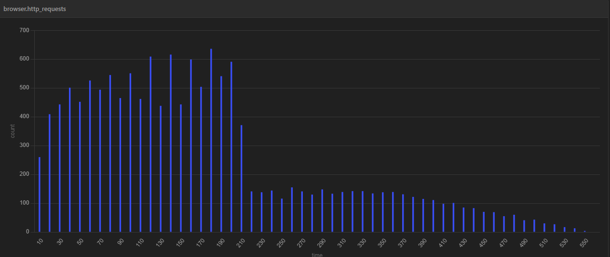

# Loadtesting results

### These are the reference sizing and loadtesting results 
These test are done in AWS eks.

<table>
  <thead>
    <tr>
      <th>Environment </th>
      <th>Setup </th>
      <th>Max Users</th>
      <th>Peak respond</th>
      <th>Average respond</th>
      <th>Database type</th>
    </tr>
  </thead>
  <tbody>
    <tr>
      <td >aws</td>
      <td>  8 core, 4 nodes</td>
      <td>50</td>
      <td> 39ms</td>
      <td> 15ms</td>
      <td>internal postgres with gp2</td>
    </tr>
    <tr>
      <td >aws</td>
      <td>  8 core, 4 nodes</td>
      <td>250</td>
      <td>27ms</td>
      <td>3ms</td>
      <td>Aurora RDS </td>
    </tr>

  </tbody>
</table>

Note: 
- Pod CPU limit = 0.2 core
- Pod RAM limit = 128MB
- gp2 IOPS = 300
- RDS IOPS = 3000 (base) / 1061 IOPS (observed)

### Findings 

For deployments where Postgres in the cluster (with an SSD attached), SSD attached read/write speed has a large impact on system capability to cope with loads.

This is due to the cloud infra providers read/write speed allocation model where the read/write speed is highly dependent on the size and type of volume purchased.

E.g. for our dev environment, we were only able to support a max of 42 users with GP2, with these specs

- Environment: wfm-alpha
- Service provider: AWS
- Cluster type: EKS
- Number of nodes: 4
- Machine type: t3a.large
- Number of vCPU per node: 2
- Size of RAM per node: 8gb
- EC2 storage: GP2, 8GB storage
- IOPS: 3000 IOPS (burstable), baseline 100 IOPS 
- Throughput: 128MiB/s (burstable), baseline 25MiB/s
- Max Number of pods per node: 35

Changing the storage type to IO2 enabled supporting up to 120 users

- Environment: wfm-qa
- Service provider: AWS
- Cluster type: EKS
- Number of nodes: 4
- Machine type: t3a.large
- Number of vCPU per node: 2
- Size of RAM per node: 8gb
- EC2 storage: IO2
- IOPS: 300IOPS (configured)
- Throughput: 75MiB/s
- Max Number of pods per node: 35

Changing the storage type to Aurora enabled supporting up to 250 users

- Environment: wfm-qa
- Service provider: AWS
- Cluster type: EKS
- Number of nodes: 4
- Machine type: t3a.large
- Number of vCPU per node: 2
- Size of RAM per node: 8gb
- EC2 storage: Aurora
- IOPS: Max observed 1061 IOPS
- Throughput: observed 228 kbps
- Max Number of pods per node: 35

### Detail report

#### Setup

- environment: aws
- Cluster type: EKS
- number of nodes: 4
- number of cores: 8
- Ram: 32gb
- number of cores per node: 2
- Ram per node: 8gb
- Machine type used: t3a.large
- Tool used: Artillery/Playwright

Figure 1 Artillery installed in EC2 instance in AWS testing the EKS cluster

In Figure 1, you can see the setup of the tester EC2 instance that was used to test the EKS clusters. Artillery and Playwright were installed in the EC2 instance so that they can run the test script, and they hit the AWS EKS clusters through the internet.

#### test steps

> - 1) User go to the log in page of AOH. 
> - 2) User enters username and password into the respective fields. 
> - 3) User waits for dashboard to load. 
> - 4) User go to Incident page. 
> - 5) User checks that the page is loaded (Add button). 
> - 6) User wait for 2 seconds (simulate think time).
> - 7) User go to Trips page.
> - 8) User waits for 2 seconds (simulates thini time).
> - 9) User goes back to incident page again.
> - 10) the loop goes on for 85 cycles.

From the test steps above, you can calculate that each user test run will take a minumum time of 340 seconds, assuming the system respond immediately.

### Detail report for test result 1

<table>
  <thead>
    <tr>
      <th>Metric </th>
      <th>Value </th>
    </tr>
  </thead>
  <tbody>
    <tr>
      <td >browser.http_requests</td>
      <td>  13811 </td>
    </tr>
    <tr>
      <td >vusers.completed</td>
      <td> 50 </td>
    </tr>
    <tr>
      <td >vusers.created</td>
      <td> 50 </td>
    </tr>
    <tr>
      <td >vusers.created_by_name.0</td>
      <td> 50 </td>
    </tr>
    <tr>
      <td >vusers.failed</td>
      <td> 0 </td>
    </tr>

  </tbody>
</table>

Average Respond time = 548/13811 = 39ms
Peak Respond time = 1000/636 = 15ms

Figure 2 http request distribution graph for test result 1

From Figure 2, you can observe that most of the http requests were made on the first 190 seconds of the test. This can be explained with the test steps involved.

Figure 3 peak request recorded over a 10 seconds period for test result 1

From figure 3, you can see that the peak http request is about 636, over a period of 10 seconds. 

### detailed report for test result 2

<table>
  <thead>
    <tr>
      <th>Metric </th>
      <th>Value </th>
    </tr>
  </thead>
  <tbody>
    <tr>
      <td >browser.http_requests</td>
      <td>  40841 </td>
    </tr>
    <tr>
      <td >vusers.completed</td>
      <td> 250 </td>
    </tr>
    <tr>
      <td >vusers.created</td>
      <td> 250 </td>
    </tr>
    <tr>
      <td >vusers.created_by_name.0</td>
      <td> 250 </td>
    </tr>
    <tr>
      <td >vusers.failed</td>
      <td> 0 </td>
    </tr>

  </tbody>
</table>

Average Respond time = 1120/40841 = 27ms
Peak Respond time = 10000/ = 3ms

Figure 4 http request distribution graph for test result 2

Figure 5 peak request recorded over a 10 seconds period for test result 2

From figure 5, you can see that the peak http request is about 2648, over a period of 10 seconds. 

Most of the load happens on the first 250 seconds.

---
# Appendix 
---
It was observed that the storage does not run at the maximum advertised speed. However, this is expected. 
For EBS under managed system in AWS, OCI and Google cloud , the maximum iops may differ from machine types and/or storage type.

Referring to https://docs.aws.amazon.com/AWSEC2/latest/UserGuide/ebs-optimized.html
For gp2 storage used in this test, it performs " at least 90 percent of their provisioned IOPS performance 99 percent of the time in a given year".
For io2 storage, the volumes " are designed to deliver at least 90 percent of their provisioned IOPS performance 99.9 percent of the time in a given year."
For aws, the maximum iops is the sum of all the ebs instant together attached to the instant. 

For OCI, the max iops may be  tied to the size of the volumne. Refer to https://docs.oracle.com/en-us/iaas/Content/Block/Concepts/blockvolumeperformance.htm

 
