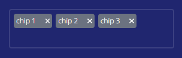

# Chip

`Chips` are elements that make it simpler to organize and view material, such as different articles from the same category.



## Usage

```sv
<script>
	import Chip from "$lib/components/Inputs/Chip.svelte";
	
	let chipValues = [];
</script>

<Chip bind:values={chipValues} />
```

Type the name of the chip and press `Enter` to search it up.

Press `Backspace` or the `X` button to remove the chip

## Props

| Option | Type | Description |
| ------ | ---- | ----------- |
| `id` | any | id of the form (auto generated) |
| `placeholder` | string | placeholder of the form |
| `values` | any[] | array of values inputted by the user |