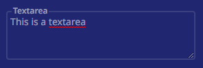

# Text Area

`Text Area` is a large text box for users to fill for any forms that require it.



## Usage

```sv
<script>
	import Textarea from "$lib/components/Inputs/Textarea.svelte";
</script>

<Textarea placeholder="Input" bgColor="bg-white" row={6} />
```

Click on the text area to type in it. The text area can be made longer or shorter by dragging it from the bottom right.

## Props

| Option | Type | Description |
| ------ | ---- | ----------- |
| `id` | any | id of the form (auto generated) |
| `placeholder` | string | placeholder of the form |
| `value` | string | user input |
| `bgColor` | string | background color of the form |
| `row` | number | default number of rows |