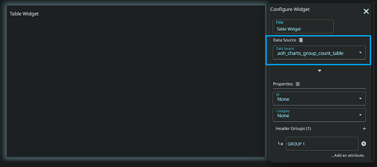
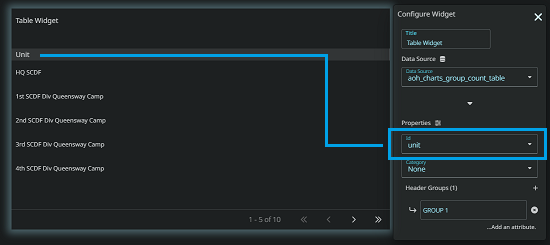

# Generic Table Widget

This widget provides a dynamic and interactive table that displays data in a user-specified format while offering filtering and column grouping functionalities.

# Configuration

## Data

| Parameter  | Type   | Description                       |
| ---------- | ------ | --------------------------------- |
| Title      | string | Title of the widget               |
| Datasource | string | Table name of the data to display |

## Properties

| Parameter     | Type          | Description                                     | Required |
| ------------- | ------------- | ----------------------------------------------- | -------- |
| ID            | String        | Unique identifier of the row                    | Yes      |
| Category      | String        | An attribute that allows the rows to be grouped | No       |
| Header Groups | HeaderGroup[] | Link multiple columns into a single group       | Yes      |

For HeaderGroup type, Please refer below.

### HeaderGroup type

| Members | Type   | Description                                                               |
| ------- | ------ | ------------------------------------------------------------------------- |
| label   | String | Serves as the label or name for the header group.                         |
| attr    | String | Determines a column key from the datasource under the given header group. |

# How to use

Assuming this is the content of your datasource named *aoh_charts_group_count_table* and you wish to group the columns between calls.

| unit                        | department | total_calls | average_calls | open_cases | closed_cases |
| --------------------------- | ---------- | ----------- | ------------- | ---------- | ------------ |
| HQ SCDF                     | SCDF       | 100         | 19            | 200        | 50           |
| Old Police Academy          | SPF        | 10          | 200           | 40         | 120          |
| 1st SCDF Div Queensway Camp | SCDF       | 10          | 5             | 4          | 3            |

 

### 1. Specify the datasource

Select the datasource that you wish to display in the datsource dropdown

### 2. Configure the row identifier.

Specify the column key of your table that identifies the row, This value will always be the first column on the table.

### 3. Specify the category (Optional)

If you want to group your rows based on a certain type, you may do so by specifying the column key that holds
the type. This will create a dropdown menu on the header that allows you to display your rows based on what it is grouped by.

*(If you do not specify this value, the dropdown menu will not appear)*.

### 4. Creating header groups and grouping columns

You may then create the header groups and assign your datasource columns to the respective header group as you desire.

- Create the header group and give them a name.
- Create an entry under the headergroup and assign them the column key to be associated with that header group
- You may rename the column header by assigning a label beside it. (optional)

After completing the following instructions, the table will be displayed.
