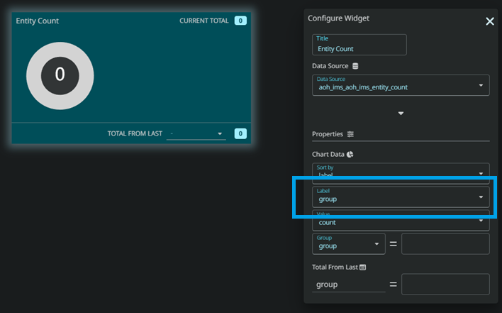
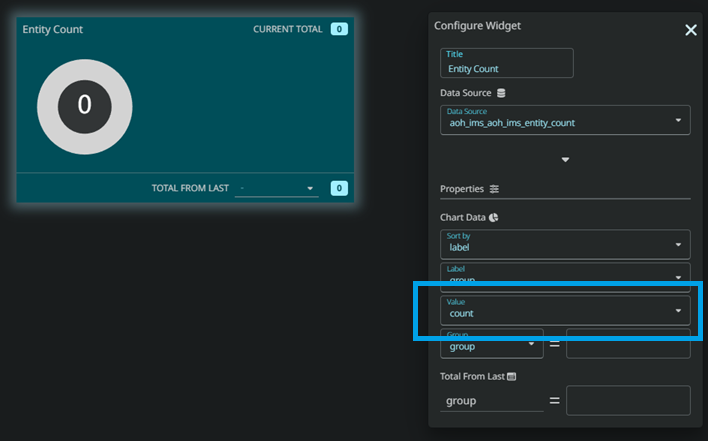
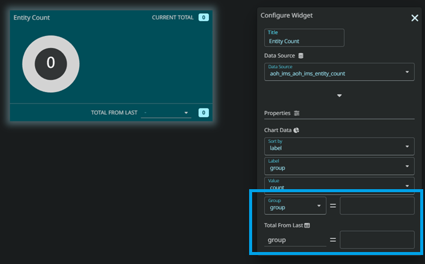

# Piechart with Progress bar

This widget combines a pie chart and a progress bar, offering a comprehensive visual insight into data distribution and ratio representation

 
 

# Configuration

## Data

| Parameter  | Type   | Description                       |
| ---------- | ------ | --------------------------------- |
| Title      | string | Title of the widget               |
| Datasource | string | Table name of the data to display |

 

## Properties

| Parameter | Type   | Description                                                                      | Required |
| --------- | ------ | -------------------------------------------------------------------------------- | -------- |
| Order     | String | Unique identifier of the row                                                     | Yes      |
| Label     | String | An attribute that allows the rows to be grouped                                  | Yes      |
| Count     | String | The column that shows the value tied to the Label attribute                      | Yes      |
| Group     | String | The column to determine whether the row is used for the dropdown or the piechart | Yes      |

 
 

# How to use

Assuming this is the content of your datasource named _aoh_charts_group_count_table_ and you wish to group the columns between calls.

| label   | count | group        |
| ------- | ----- | ------------ |
| 0-4H    | 10    | NOT_DROPDOWN |
| 20-24H  | 23    | NOT_DROPDOWN |
| 4-20H   | 30    | NOT_DROPDOWN |
| 30 days | 200   | IS_DROPDOWN  |
| 60 days | 362   | IS_DROPDOWN  |

 

 

The widget contains 2 segments: The piechart and the dropdown menu on the footer. So for this example, the column _group_ will be the one that is determining which row goes to which segment.

:::note
The data requires an attribute that determines whether the row goes into the piechart or the dropdown.
:::

 

### 1. Specify the datasource

 

Select the datasource that you wish to display in the datsource dropdown.

### 2. Configure the order key.

 

Specify the column in the datasource that you wish to sort the order by. This will sort the the rows based on the column you specified.

### 3. Specify the label key

 

Specify the column that will give you the labels for the pie charts and dropdown menus. For this example, the column to use for this datasource would be the _label_ column

If you want to group your rows based on a certain type, you may do so by specifying the column key that holds
the type. This will create a dropdown menu on the header that allows you to display your rows based on what it is grouped by.

_(If you do not specify this value, the dropdown menu will not appear)_.

### 4. Choosing the value key

 

Pick the column that has the value tied to the labels chosen above. For this example, the column _count_ is used.

### 5. Grouping the rows

 

As mentioned above, the rows will be grouped into 2 segments, one for the piechart and the other for the dropdown menu. So select the key in your table that has the indicator to determine which row goes to which.

You then input the values in these field that will determine which row will go to which segment. For this example, we will use the _group_ column and in the _group_ column. The rows with the value of `IS_DROPDOWN` will go to the dropdown menu in the "Total From Last section" and those with the value of `NOT_DROPDOWN` will go into the pie chart.

After that the widget will display on your dashboard with the given datasource.
