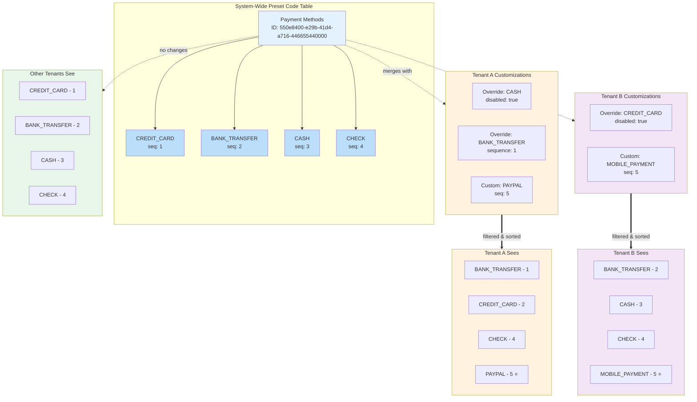

# Core Concepts

This guide provides an in-depth understanding of the core concepts in the App Settings and Preferences service, including code tables, localization, and multi-tenancy.

## Code Tables

Code tables are structured collections of key-value pairs that power dynamic UI components in your application, such as dropdown menus, select boxes, radio button groups, tree selectors, and other choice-based interface elements. Instead of hardcoding options in your frontend code, code tables provide a centralized, manageable data source that can be updated without deploying new application code.

### Primary Use Cases

Code tables are designed to populate UI components that require selectable options:

**Simple Dropdowns**
- User status options (Active, Inactive, Suspended)
- Priority levels (Low, Medium, High, Critical)
- Document types (Invoice, Receipt, Report)
- Task categories (Bug, Feature, Enhancement)

**Tree Hierarchy Selectors**
- Geographic hierarchies (Country → State/Province)
- Organizational structures (Department → Team)
- Product categories (Category → Subcategory)
- File system navigation (Folder → Subfolder)

**Cascading Dropdowns**
When selecting a country from a dropdown automatically updates the state/province dropdown - powered by hierarchical code tables with up to 2 levels of depth.

### Code Table Types

ASP supports two types of code tables to accommodate different organizational needs:

**Preset Tables**
- Created by system administrators with the `system-admin` role
- Shared across all tenants in the system
- Serve as standardized, organization-wide configurations
- Example: Standard industry codes, ISO country codes, universal status values

**Custom Tables**
- Created by tenant administrators with the `tenant-admin` role
- Isolated to a specific tenant's scope
- Allow tenant-specific customizations and business rules
- Example: Company-specific department lists, custom workflow states

### Code Table Structure

Each code table contains multiple entries, and each entry includes the following fields:

#### `code_key`
- **Type**: `string`
- **Required**: Yes
- **Description**: Internal identifier used in application logic
- **Format**: Uppercase with underscores (e.g., `"US"`, `"ACTIVE"`, `"HIGH_PRIORITY"`)
- **Characteristics**:
  - Remains constant even if display values change
  - Used for storage, API requests, and business logic
  - Must be unique within the code table

#### `display_value`
- **Type**: `string`
- **Required**: Yes
- **Description**: Human-readable label shown in the UI
- **Examples**: `"United States"`, `"Active"`, `"High Priority"`
- **Usage**: What users see in dropdown menus and other UI components
- **Note**: Can be updated without affecting application logic that uses the code key

#### `sequence`
- **Type**: `integer`
- **Required**: Yes
- **Default**: `999`
- **Description**: Controls the display order in UI components
- **Behavior**:
  - Lower numbers appear first (sequence 1 displays before sequence 10)
  - Allows administrators to reorder options without changing the underlying data
  - Can be overridden per tenant for customized ordering

#### `description`
- **Type**: `string`
- **Required**: No
- **Default**: `null`
- **Description**: Detailed explanation or tooltip text
- **Usage**:
  - Provides additional context for administrators or end-users
  - Can be displayed as help text in the UI

#### `message_id`
- **Type**: `string`
- **Required**: No
- **Default**: `null`
- **Description**: Reference to a localized message definition
- **Purpose**:
  - Enables multilingual support by linking to translated display values
  - Allows the same code entry to show different text based on user locale
- **Format**: Dot-notation namespace (e.g., `"user.status.active"`)

#### `sub_code_table_id`
- **Type**: `UUID`
- **Required**: No
- **Default**: `null`
- **Description**: Link to a child code table that depends on this entry
- **Purpose**:
  - Enables tree hierarchy and cascading selection patterns
  - Creates parent-child relationships between code tables
- **Constraint**: Maximum depth of 2 levels (parent → child)

### Hierarchical Code Tables (Tree Structures)

One of ASP's most powerful features is the ability to create hierarchical relationships between code tables, enabling complex tree-based UI components.

**How Hierarchy Works**

1. **Create Parent Code Table**: For example, a "Countries" code table with entries like USA, Canada, China
2. **Create Child Code Table**: For example, a "US States" code table with entries like California, Texas, New York
3. **Attach Child to Parent Entry**: Link the "US States" table to the "USA" entry in the "Countries" table

:::info
ASP supports a maximum depth of 2 levels (parent → child). This design keeps data structures manageable and maintains optimal performance for UI components.
:::

:::warning
**Type Matching Requirement**: A preset sub-code table can only be attached to a preset code table entry, and a custom sub-code table can only be attached to a custom code table entry. Preset and custom code tables cannot be mixed in hierarchical relationships.
:::

**Example: Organizational Hierarchy**

```
Departments (Code Table)
├── Engineering (Code Entry)
│   └── Engineering Teams (Sub-Code Table)
│       ├── Backend Team
│       ├── Frontend Team
│       ├── DevOps Team
│       └── QA Team
├── Sales (Code Entry)
│   └── Sales Teams (Sub-Code Table)
│       ├── Enterprise Sales
│       ├── SMB Sales
│       └── Partner Sales
└── Marketing (Code Entry)
    └── Marketing Teams (Sub-Code Table)
        ├── Digital Marketing
        ├── Content Marketing
        └── Product Marketing
```

### Tenant Overrides for Code Tables

ASP provides powerful tenant-level customization capabilities that allow individual tenants to modify preset code tables without affecting other tenants in the system. This enables a shared foundation of configurations while supporting tenant-specific business requirements.

#### Understanding Tenant Overrides

When a system administrator creates a **preset code table**, it becomes available to all tenants as the default configuration. However, tenants often need to customize these shared configurations to match their specific workflows, terminology, or business rules. ASP supports this through two mechanisms:

1. **Overriding Preset Entries**: Modify how preset entries behave for a specific tenant
2. **Adding Custom Entries**: Extend preset tables with tenant-specific entries

All modifications are **tenant-scoped**, meaning that changes only affect the tenant that made them while other tenants continue to see the original preset configuration. The system maintains a single source of truth (the preset table) with tenant-specific deltas, ensuring that customizations are isolated and do not impact other organizations using the same platform.

#### Override Capabilities

Tenants can override preset code table entries in the following ways:

**Disable Entries**
- Hide specific preset entries from appearing in dropdowns
- Useful when certain options don't apply to a tenant's operations
- The entry remains in the preset table but is filtered out for that tenant
- Example: Disable "Credit Card" payment method if a tenant only accepts bank transfers

**Change Entry Sequence**
- Reorder how preset entries display in the tenant's UI
- Allows prioritizing frequently used options
- Does not affect the sequence for other tenants
- Example: Move "High Priority" to the top of a priority list for urgent-focused workflows

**Combination**
- Both disable and sequence changes can be applied simultaneously
- Provides complete control over entry visibility and ordering

#### Adding Custom Entries to Preset Tables

Beyond overriding existing entries, tenants can add their own entries to preset code tables:

**Custom Entry Characteristics**
- Tenant-specific entries that appear alongside preset entries
- Only visible to the tenant that created them
- Can have all the same properties as preset entries (code_key, display_value, sequence, message_id)
- Can participate in hierarchies (can have sub-code tables attached)


#### Complete Example: Payment Methods

This example demonstrates how different tenants can customize the same preset code table to meet their specific business requirements.

**Initial Setup by System Admin**

The system admin creates a preset "Payment Methods" code table using:

**API**: `POST /code-table/preset`

```json
{
  "name": "payment_methods",
  "module": "billing",
  "entries": [
    { "code_key": "CREDIT_CARD", "display_value": "Credit Card", "sequence": 1 },
    { "code_key": "BANK_TRANSFER", "display_value": "Bank Transfer", "sequence": 2 },
    { "code_key": "CASH", "display_value": "Cash", "sequence": 3 },
    { "code_key": "CHECK", "display_value": "Check", "sequence": 4 }
  ]
}
```

This creates a code table with UUID `550e8400-e29b-41d4-a716-446655440000` (example ID used throughout).

**Tenant A Customizations**

Tenant A (e-commerce business) makes the following changes:

1. **Disable "CASH"** (not supported for online orders)
   - **API**: `PUT /code-table/550e8400-e29b-41d4-a716-446655440000/override/{cash-entry-id}`
   - **Body**: `{ "disabled": true }`

2. **Change "BANK_TRANSFER" sequence to 1** (most common method)
   - **API**: `PUT /code-table/550e8400-e29b-41d4-a716-446655440000/override/{bank-transfer-entry-id}`
   - **Body**: `{ "sequence": 1 }`

3. **Add custom entry "PAYPAL"** (tenant-specific integration)
   - **API**: `PUT /code-table/550e8400-e29b-41d4-a716-446655440000/custom-entry`
   - **Body**:
     ```json
     {
       "table_id": "550e8400-e29b-41d4-a716-446655440000",
       "tenant_id": "tenant-a-uuid",
       "code_key": "PAYPAL",
       "display_value": "PayPal",
       "sequence": 5
     }
     ```

**Tenant A sees:**

When Tenant A fetches the code table using:
- **API**: `GET /code-table/550e8400-e29b-41d4-a716-446655440000`
```json
[
  { "code_key": "BANK_TRANSFER", "display_value": "Bank Transfer", "sequence": 1 },
  { "code_key": "CREDIT_CARD", "display_value": "Credit Card", "sequence": 2 },
  { "code_key": "CHECK", "display_value": "Check", "sequence": 4 },
  { "code_key": "PAYPAL", "display_value": "PayPal", "sequence": 5, "custom": true }
]
```

**Tenant B Customizations**

Tenant B (retail store) makes different changes:

1. **Disable "CREDIT_CARD"** (cash-only business)
   - **API**: `PUT /code-table/550e8400-e29b-41d4-a716-446655440000/override/{credit-card-entry-id}`
   - **Body**: `{ "disabled": true }`

2. **Add custom entry "MOBILE_PAYMENT"**
   - **API**: `PUT /code-table/550e8400-e29b-41d4-a716-446655440000/custom-entry`
   - **Body**:
     ```json
     {
       "table_id": "550e8400-e29b-41d4-a716-446655440000",
       "tenant_id": "tenant-b-uuid",
       "code_key": "MOBILE_PAYMENT",
       "display_value": "Mobile Payment",
       "sequence": 5
     }
     ```

**Tenant B sees:**

When Tenant B fetches the code table using:
- **API**: `GET /code-table/550e8400-e29b-41d4-a716-446655440000`
```json
[
  { "code_key": "BANK_TRANSFER", "display_value": "Bank Transfer", "sequence": 2 },
  { "code_key": "CASH", "display_value": "Cash", "sequence": 3 },
  { "code_key": "CHECK", "display_value": "Check", "sequence": 4 },
  { "code_key": "MOBILE_PAYMENT", "display_value": "Mobile Payment", "sequence": 5, "custom": true }
]
```

**Other Tenants See**

When any other tenant fetches the code table using:
- **API**: `GET /code-table/550e8400-e29b-41d4-a716-446655440000`

All other tenants see the original preset configuration:
```json
[
  { "code_key": "CREDIT_CARD", "display_value": "Credit Card", "sequence": 1 },
  { "code_key": "BANK_TRANSFER", "display_value": "Bank Transfer", "sequence": 2 },
  { "code_key": "CASH", "display_value": "Cash", "sequence": 3 },
  { "code_key": "CHECK", "display_value": "Check", "sequence": 4 }
]
```

#### Tenant Isolation Visualization

The following diagram illustrates how the same preset code table appears differently to each tenant based on their customizations:




#### Resetting Overrides

Tenants can reset all their customizations to return to the preset configuration:

```http
DELETE /code-table/{id}/reset
```

This removes:
- All override records (disabled flags, sequence changes)
- All custom entries added by the tenant
- The tenant returns to seeing the original preset configuration


## Localization

Message definitions support internationalization by allowing the same application to display content in multiple languages based on user preferences.

### Message Definitions

A message definition is a collection of translated text values grouped under a single `message_id`. Resources such as code table entries can be assigned a `message_id`, and ASP will automatically retrieve the appropriate language text based on the user's locale preference.

**Structure**

Each message definition contains:

#### `message_id`
- **Type**: `string`
- **Required**: Yes
- **Description**: Unique identifier that resources reference to retrieve localized text
- **Format**: Dot-notation namespace (e.g., `"user.status.active"`, `"payment.method.credit_card"`)
- **Usage**: Assigned to resources like code table entries via their `message_id` field

#### `module`
- **Type**: `string`
- **Required**: Yes
- **Description**: Application module this message belongs to
- **Purpose**: Enables organization and filtering of messages by module

#### `functional_type`
- **Type**: `integer`
- **Required**: Yes
- **Description**: Numeric category for grouping related messages
- **Purpose**: Allows filtering and organizing messages by type

#### `messages`
- **Type**: `array`
- **Required**: Yes
- **Description**: Collection of translations, each containing:
  - `locale_code` (string): Language/region identifier (e.g., `"en-US"`, `"zh-CN"`, `"ms-MY"`)
  - `message_text` (string): Translated content for that locale

### How Localization Works

Resources like code table entries can be assigned a `message_id` to enable multi-language support. When a user requests data with a specific locale, ASP automatically retrieves the corresponding translated text.

**Example: Localized Code Table Entry**

1. **Create a message definition** with translations:
```json
{
  "message_id": "user.status.active",
  "module": "user_management",
  "functional_type": 1,
  "messages": [
    { "locale_code": "en-US", "message_text": "Active" },
    { "locale_code": "zh-CN", "message_text": "活跃" },
    { "locale_code": "ms-MY", "message_text": "Aktif" }
  ]
}
```

2. **Assign the message_id to a code table entry**:
```json
{
  "code_key": "ACTIVE",
  "display_value": "Active",
  "message_id": "user.status.active"
}
```

3. **ASP automatically resolves the translation** when fetching:
   - Request: `GET /code-table/{id}?locale=zh-CN`
   - Response: Entry displays as "活跃" (Chinese)
   - Request: `GET /code-table/{id}?locale=ms-MY`
   - Response: Entry displays as "Aktif" (Malay)
   - Request: `GET /code-table/{id}` (no locale)
   - Response: Entry displays "Active" (fallback to `display_value`)

### Tenant Overrides

Tenants can customize preset messages in two ways:

**Add Custom Locales**
- Extend preset message definitions with additional language support
- Example: Add Malay translation to a preset English-only message

**Override Existing Messages**
- Customize translations for specific locales within their tenant
- Example: Change "Active" to "Currently Active" for better clarity


