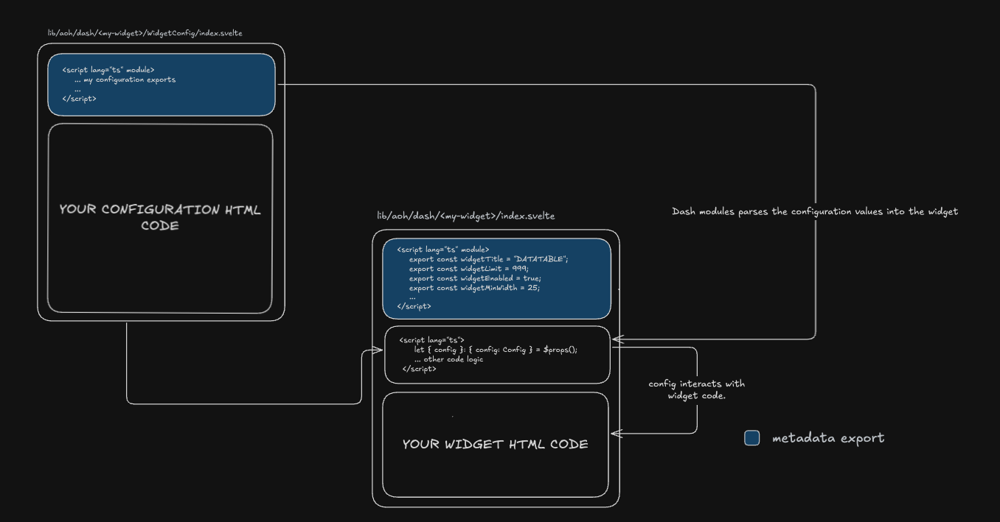

# Dashboard Module Development

This guide covers developing custom widgets for the Dashboard (DASH) module. Widgets are the building blocks that users can add, configure, and arrange on their dashboards.

## Understanding Widgets

Widgets are self-contained Svelte components that display data, visualizations, or interactive content on a dashboard. Each widget can be customized, positioned, and resized by users without requiring code changes.

### What Makes a Widget?

Widgets are Svelte components that become "dashboard widgets" through:

1. **Location** - Placed in `$lib/aoh/dash/widgets/` directory
2. **Code Signature** - Export specific metadata in a module script
3. **Optional Configuration** - Can include a `WidgetConfig` component for user customization

### Widget Folder Structure

Every widget follows this basic folder structure:

```
$lib/aoh/dash/widgets/<my-widget>/
├── index.svelte              # Main widget component (required)
└── WidgetConfig/            # Optional configuration UI
    └── index.svelte
```

When you create a folder with an `index.svelte` file in the widgets directory and export the required metadata, it automatically appears in the widget palette.

## Widget Internal Structure

Before we start building, let's understand how widgets work internally and how configuration flows through the system.



### How Widget Configuration Flows

The diagram above shows the relationship between three key components:

1. **WidgetConfig File** (`/WidgetConfig/index.svelte`) - Defines the configuration interface and UI
   - Exports the `Config` interface defining configuration structure
   - Exports `defaults` object with default configuration values
   - Provides UI components for users to modify configuration

2. **Widget Main File** (`/index.svelte`) - The actual widget component
   - **Module Script**: Exports widget metadata (title, size constraints, icon, etc.)
   - **Component Script**: Receives `config` as props and implements widget logic
   - **Template**: Renders the widget UI using configuration values

3. **DASH Module** - The framework that ties everything together
   - Parses widget metadata during build time
   - Injects configuration values into widgets at runtime
   - Handles merging defaults with user-saved settings

**Key Concept**: The `config` object is the bridge between WidgetConfig and the main widget. WidgetConfig defines its structure and defaults, while the main widget receives and uses these values to customize its behavior.

## Creating Your First Widget

Let's create a simple widget step by step. We'll build a basic "Info" widget that displays some text.

### Step 1: Create the Widget File

Create a new folder in `$lib/aoh/dash/widgets/` with your widget name, then create an `index.svelte` file:

```typescript title="src/lib/aoh/dash/widgets/info-widget/index.svelte"
<script lang="ts" module>
  // Required metadata exports
  export const widgetTitle = "INFO_WIDGET";
  export const widgetEnabled = true;
  export const widgetMinWidth = 4;
  export const widgetMinHeight = 3;
  export const widgetIcon = "info";

  // Optional metadata exports
  export const widgetMaxWidth = 8;
  export const widgetMaxHeight = 6;
  export const widgetLimit = 5;
</script>

<script lang="ts">
  // Your component logic here
  let message = "Hello from Info Widget!";
</script>

<!-- Your widget UI -->
<div class="w-full h-full p-4">
  <h2 class="text-lg font-bold">Info Widget</h2>
  <p>{message}</p>
</div>
```

**What each metadata property does:**
- `widgetTitle`: Unique identifier and display name (UPPERCASE convention)
- `widgetEnabled`: Controls whether widget appears in palette
- `widgetMinWidth`/`widgetMinHeight`: Minimum size in grid units
- `widgetMaxWidth`/`widgetMaxHeight`: Maximum size in grid units
- `widgetIcon`: Lucide icon name (kebab-case) - browse at [lucide.dev](https://lucide.dev)
- `widgetLimit`: Maximum instances allowed per dashboard

### Step 2: Test Your Widget

1. Save the file
2. Start your development server
3. Navigate to the dashboard page
4. Click "Add Widget" - your widget should appear in the palette
5. Add it to a dashboard and test resizing/positioning

### Step 3: Add Your Content

Replace the placeholder UI with your actual widget content:

```typescript title="Your widget UI section"
<script lang="ts">
  import { onMount } from "svelte";

  let data = $state(null);

  onMount(async () => {
    // Fetch your data
    const response = await fetch('/api/your-endpoint');
    data = await response.json();
  });
</script>

<div class="w-full h-full p-4 flex flex-col">
  {#if data}
    <!-- Your data visualization here -->
    <div class="flex-1">
      {/* Display your data */}
    </div>
  {:else}
    <p>Loading...</p>
  {/if}
</div>
```

## Registering Your Widget

After creating your widget, you need to **register it in the database** to make it persistent and available across all users. Registration stores the widget's metadata in the database, allowing administrators to modify widget properties (like size constraints or limits) without changing code.

### Why Registration is Important

**Unregistered widgets:**
- Work in development but use file system defaults only
- Cannot have their metadata modified by administrators
- Are not persisted in the database

**Registered widgets:**
- Have their metadata stored in the database
- Can be configured by administrators (modify limits, enable/disable)
- Metadata persists across deployments and users
- Database values override file system defaults

### How to Register

1. Navigate to the **Widget Types Admin Page** in your application:
   - Go to `/aoh/dash/admin/widget-types`

2. Find your widget in the list of available widgets

3. Click **Register** or **Publish** to save it to the database

4. Once registered, you can:
   - Modify widget metadata (name, icon, size constraints)
   - Set instance limits per dashboard
   - Enable/disable widgets without code changes

:::tip
During development, widgets work without registration using their file system defaults. Register them when you're ready to deploy or need centralized metadata management.
:::

After registration, any metadata changes made through the admin interface will override the defaults in your widget file.

## Widget Metadata Reference

Complete reference for all widget metadata properties.

### Required Exports

These properties **must** be exported for the widget to appear in the palette:

| Property | Type | Description | Example | Notes |
|----------|------|-------------|---------|-------|
| `widgetTitle` | `string` | Display name in widget palette (UPPERCASE convention) | `"MY_WIDGET"` | Must be unique. Prefix with `_` to hide from palette (e.g., `"_TEMPLATE"`) |
| `widgetEnabled` | `boolean` | Whether widget appears in palette | `true` | Set to `false` to disable temporarily |
| `widgetMinWidth` | `number` | Minimum width in grid columns (1-12) | `4` | Dashboard uses 12-column grid system |
| `widgetMinHeight` | `number` | Minimum height in grid rows | `3` | Prevents widget from being too small |
| `widgetIcon` | `string` | Lucide icon name (kebab-case) | `"activity"` | Browse icons at [lucide.dev](https://lucide.dev) |

### Optional Exports

These properties enhance widget functionality but are not required:

| Property | Type | Description | Default | Example |
|----------|------|-------------|---------|---------|
| `widgetLimit` | `number` | Maximum instances allowed per dashboard | `999` | `5` |
| `widgetMaxWidth` | `number` | Maximum width in grid columns | `12` | `8` |
| `widgetMaxHeight` | `number` | Maximum height in grid rows | `undefined` | `6` |

### Complete Example

```typescript title="Complete widget metadata example"
<script lang="ts" module>
  // Required exports
  export const widgetTitle = "INCIDENT_TRACKER";
  export const widgetEnabled = true;
  export const widgetMinWidth = 6;
  export const widgetMinHeight = 4;
  export const widgetIcon = "alert-triangle";

  // Optional exports
  export const widgetLimit = 3;
  export const widgetMaxWidth = 12;
  export const widgetMaxHeight = 8;
</script>
```

### Special Behaviors

**Fixed Size Widget:**
Set min and max to the same value to prevent resizing:
```typescript
export const widgetMinWidth = 6;
export const widgetMaxWidth = 6;  // Same as min = fixed width
export const widgetMinHeight = 4;
export const widgetMaxHeight = 4; // Same as min = fixed height
```

**Hidden Widget:**
Prefix title with underscore or set `widgetEnabled` to `false`:
```typescript
export const widgetTitle = "_INTERNAL_WIDGET";  // Hidden from palette
// OR
export const widgetEnabled = false;             // Disabled
```

## Adding Widget Configuration

Widget configuration is **optional** but recommended for flexible, reusable widgets. It allows users to customize widget behavior without editing code.

### When to Add Configuration

Add configuration when your widget needs:
- User-customizable display options (colors, labels, formats)
- Data source selection
- Refresh intervals or polling settings
- Feature toggles

### Configuration Structure

The widget configuration is simply a Svelte file that defines how users can customize your widget. **You have complete freedom** to design the configuration UI however you want—use any components, layouts, or styling that suits your needs.

**The only requirements are:**
1. Export a `Config` interface defining your configuration structure
2. Export a `defaults` object with default values for all configuration properties

**How Defaults Work:**
When a widget is first added to a dashboard or if no custom configuration has been saved, the DASH module automatically retrieves the `defaults` object from your WidgetConfig and passes it to your widget. If a user has customized the configuration, the saved values are merged with the defaults (saved values take precedence) before being passed to your widget.

### Creating Configuration

Create a `WidgetConfig` folder inside your widget with its own `index.svelte`:

```typescript title="src/lib/aoh/dash/widgets/<my-widget>/WidgetConfig/index.svelte"
<script lang="ts" module>
  // Define the configuration interface
  export interface Config {
    title: string;
    refreshInterval: number;
    showHeader: boolean;
  }

  // Provide default values
  export const defaults: Config = {
    title: "My Widget",
    refreshInterval: 60,
    showHeader: true
  };
</script>

<script lang="ts">
  import Input from "$lib/aoh/core/components/ui/input/input.svelte";
  import Label from "$lib/aoh/core/components/ui/label/label.svelte";
  import { Switch } from "$lib/aoh/core/components/ui/switch";

  // Config must be bindable for changes to persist
  let { config = $bindable() }: { config: Config } = $props();
</script>

<!-- Configuration UI -->
<div class="flex flex-col gap-4 p-4">
  <div>
    <Label for="title">Title</Label>
    <Input id="title" bind:value={config.title} />
  </div>

  <div class="flex items-center justify-between">
    <Label for="show-header">Show Header</Label>
    <Switch id="show-header" bind:checked={config.showHeader} />
  </div>
</div>
```

### Using Configuration in Your Widget

Update your widget to receive and use the configuration:

```typescript title="src/lib/aoh/dash/widgets/<my-widget>/index.svelte"
<script lang="ts" module>
  export const widgetTitle = "CONFIGURABLE_WIDGET";
  export const widgetEnabled = true;
  export const widgetMinWidth = 4;
  export const widgetMinHeight = 3;
  export const widgetIcon = "settings";
</script>

<script lang="ts">
  import { defaults, type Config } from "./WidgetConfig/index.svelte";

  // Receive configuration via props
  let { config = $bindable(defaults) }: { config: Config } = $props();
</script>

<!-- Use config values in your widget -->
<div class="w-full h-full p-4">
  {#if config.showHeader}
    <h2 class="text-lg font-bold">{config.title}</h2>
  {/if}
  <p>Refresh interval: {config.refreshInterval}s</p>
  <!-- Your widget content -->
</div>
```

## How Widget Detection Works

The DASH module uses a sophisticated multi-stage system to automatically detect, register, and load widgets. Understanding this helps when troubleshooting.

:::warning
Widgets will **not** be detected if:
- Required metadata exports are missing (widgetTitle, widgetEnabled, widgetMinWidth, widgetMinHeight, widgetIcon)
- There are syntax or compilation errors in your widget code
- The widget file is not placed in the correct directory (`$lib/aoh/dash/widgets/`)

Always check the console for error messages if your widget doesn't appear in the palette.
:::

The detection process works in stages:

1. **File System Discovery** - At build time, Vite's `import.meta.glob` scans for all widget files
2. **Widget Registration** - Widgets are registered with their metadata in the system
3. **Dynamic Loading** - Widget components load on-demand when a dashboard opens
4. **Widget Initialization** - Configuration is merged and widgets are added to the grid

For most developers, you don't need to worry about these internals—just follow the structure and the system handles the rest automatically.
