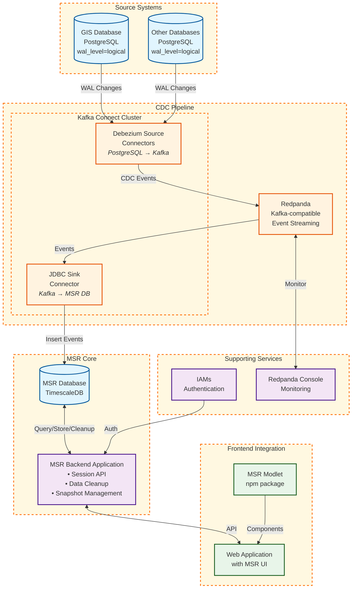

# Deployment

This document provides comprehensive guidance on deploying the MSR (Multi-Session Replay) module backend infrastructure in production environments. A successful deployment consists of the MSR backend server and supporting infrastructure for change data capture. The frontend interface is provided through the MSR modlet installed in web-base projects.

## Prerequisites

Before deploying MSR, ensure you have:

-   **Container Runtime**: Docker or Podman with compose support
-   **Module Dependencies**: Deployed instance of `iams` module for authentication
-   **Network Access**: Connectivity between MSR components and dependency services
-   **Storage**: Adequate disk space for TimescaleDB and Redpanda data retention
-   **Environment File**: Properly configured `.env` file with required variables

### Critical PostgreSQL Requirements

:::danger Critical Database Configuration
The source PostgreSQL databases that you want to capture changes from MUST have specific configuration settings enabled. Without these settings, Debezium CDC will not function.
:::

#### 1. PostgreSQL Write-Ahead Logging (WAL) Configuration

The source PostgreSQL database **MUST** have the WAL level set to `logical` to enable change data capture:

```sql
-- Check current WAL level
SHOW wal_level;

-- Must return: 'logical'
```

If the WAL level is not set to `logical`, configure it:

**Option A: Server startup parameter (recommended)**
```bash
# Start PostgreSQL with logical WAL level
postgres -c wal_level=logical
```

**Option B: PostgreSQL configuration file**
```ini
# postgresql.conf
wal_level = logical
```

:::warning Database Restart Required
Changing the WAL level requires a PostgreSQL server restart. Plan this change during a maintenance window.
:::

#### 2. Table REPLICA IDENTITY Configuration

Each table that you want to track with CDC **MUST** have its `REPLICA IDENTITY` set to `FULL`:

```sql
-- Set REPLICA IDENTITY for each tracked table
ALTER TABLE schema_name.table_name REPLICA IDENTITY FULL;

-- Example for GIS module tables
ALTER TABLE gis.geo_entity REPLICA IDENTITY FULL;
ALTER TABLE gis.bookmark REPLICA IDENTITY FULL;
```

:::info Why REPLICA IDENTITY FULL?
The `FULL` setting ensures that Debezium captures the complete row data for all change events (INSERT, UPDATE, DELETE). This is required for MSR to properly reconstruct entity states during replay.
:::

#### 3. Database User Permissions

The database user configured in Debezium connectors must have:

-   `REPLICATION` privilege for creating replication slots
-   `SELECT` privilege on all tables to be tracked
-   `CREATE` privilege on the database (for replication slots)

```sql
-- Grant necessary permissions
ALTER USER debezium_user REPLICATION;
GRANT SELECT ON ALL TABLES IN SCHEMA target_schema TO debezium_user;
```

## Container Images

The MSR backend deployment uses the following container images:

| Component            | Image                                               | Purpose                             |
| -------------------- | --------------------------------------------------- | ----------------------------------- |
| **MSR App**          | `ghcr.io/mssfoobar/msr/msr-app:latest`              | Main backend server                 |
| **MSR Database**     | `ghcr.io/mssfoobar/msr/timescaledb:2.22.0-pg17-aoh` | TimescaleDB for session data        |
| **Redpanda**         | `docker.redpanda.com/redpandadata/redpanda:latest`  | Kafka-compatible streaming platform |
| **Redpanda Console** | `docker.redpanda.com/redpandadata/console:latest`   | Redpanda management interface       |
| **Kafka Connect**    | `ghcr.io/mssfoobar/debezium-connect:latest`         | Kafka Connect cluster runtime with Debezium |

As of @mssfoobar/msr/msr-app version `1.2.0`, timescaledb version `2.22.0` is required for multi-column SkipScan support.

:::note Frontend Interface
The MSR frontend interface is provided through the MSR modlet, which is installed into web-base projects using `npx cli install msr`. No separate frontend container deployment is required.
:::

:::tip
Use specific version tags instead of `latest` for production deployments to ensure consistency and easier rollbacks.
:::

## Deployment Steps

### 1. Prepare Source Databases

Before deploying MSR infrastructure, ensure all source databases are properly configured:

#### Configure PostgreSQL WAL Level

```yaml
# Example: Docker Compose configuration
services:
  source-db:
    image: postgres:17
    # Enable logical replication at startup
    command: ["postgres", "-c", "wal_level=logical"]
    environment:
      - POSTGRES_DB=myapp
      - POSTGRES_USER=myuser
      - POSTGRES_PASSWORD=mypassword
```

#### Configure Table REPLICA IDENTITY

Create a preparation script for your source database:

```sql
-- prepare-cdc.sql
-- Run this after your application tables are created

-- Example for a hypothetical application
ALTER TABLE app.users REPLICA IDENTITY FULL;
ALTER TABLE app.transactions REPLICA IDENTITY FULL;
ALTER TABLE app.audit_logs REPLICA IDENTITY FULL;

-- Verify configuration
SELECT 
    schemaname,
    tablename,
    CASE 
        WHEN relreplident = 'f' THEN 'FULL'
        WHEN relreplident = 'd' THEN 'DEFAULT'
        WHEN relreplident = 'n' THEN 'NOTHING'
        WHEN relreplident = 'i' THEN 'INDEX'
    END as replica_identity
FROM pg_tables t
JOIN pg_class c ON c.relname = t.tablename
WHERE schemaname = 'app';
```

### 2. Deploy Infrastructure

Deploy the infrastructure components using the dev-containers setup:

```bash
# From dev-containers directory
docker compose --env-file .env -f msr/compose.yml -f compose.override.yml up -d
```

This deploys:

-   **MSR Database**: TimescaleDB instance for time-series data storage
-   **Redpanda**: Kafka-compatible streaming platform for event transport
-   **Kafka Connect Service** (`kafka-connect-dbz`): The cluster runtime that hosts all connectors
    - This is a single service/container that runs the Kafka Connect framework
    - Both source and sink connectors are deployed as configurations to this service
    - The service manages connector lifecycle, scaling, and fault tolerance

:::note About Kafka Connect
Kafka Connect is deployed as a service (container) that provides the execution environment for connectors. The connectors themselves are not separate containers but rather configurations that run within the Kafka Connect service.
:::

See the [Kafka Connect configuration guide](../configuration/kafka-connect.mdx) for detailed connector setup.

### 3. Configure Kafka Connect Connectors

After the Kafka Connect cluster service is deployed and running, configure the connectors that will run within it:

:::important Kafka Connect Service Required
The Kafka Connect cluster (`kafka-connect-dbz` service) must be deployed and running before you can configure connectors. This service provides the runtime environment where both Debezium source connectors and the JDBC sink connector execute.
:::

#### Deploy Connectors to Kafka Connect

#### Example Source Connector Configuration

```json
{
    "name": "myapp-source-connector",
    "config": {
        "connector.class": "io.debezium.connector.postgresql.PostgresConnector",
        "database.hostname": "source-db",
        "database.port": "5432",
        "database.user": "debezium_user",
        "database.password": "debezium_password",
        "database.dbname": "myapp",
        "database.server.name": "myapp_server",
        "topic.prefix": "myapp_server",
        "table.include.list": "app.users,app.transactions",
        "plugin.name": "pgoutput",
        "slot.name": "debezium_myapp_slot",
        "snapshot.mode": "initial",
        "key.converter": "org.apache.kafka.connect.json.JsonConverter",
        "value.converter": "org.apache.kafka.connect.json.JsonConverter",
        "signal.enabled.channels": "kafka",
        "signal.kafka.topic": "msr.debezium_adhoc_snapshots",
        "signal.kafka.bootstrap.servers": "redpanda:9092"
    }
}
```

:::tip Connector Configuration
- Use unique `slot.name` for each connector to avoid conflicts
- Enable signal channels for ad-hoc snapshot capability
- Configure appropriate `table.include.list` for tables with REPLICA IDENTITY FULL
:::

#### Configure Sink Connector

The sink connector writes CDC events to the MSR database:

```json
{
    "name": "cdc-sink-connector",
    "config": {
        "connector.class": "io.confluent.connect.jdbc.JdbcSinkConnector",
        "topics": "myapp_server.app.users,myapp_server.app.transactions",
        "connection.url": "jdbc:postgresql://msr-database:5432/msr",
        "connection.user": "msr_user",
        "connection.password": "msr_password",
        "table.name.format": "msr.cdc_event",
        "insert.mode": "insert",
        "pk.mode": "none",
        "auto.create": "false",
        "auto.evolve": "false"
    }
}
```

### 4. Deploy Application

Deploy the MSR backend application:

**Artifact**: `ghcr.io/mssfoobar/msr/msr-app:latest`

Ensure the application is configured with proper environment variables. See the [configuration section](../configuration/app-configuration.mdx) for required variables.

#### Initial Bootstrap

On first deployment, the MSR Backend Application automatically:

-   **Creates initial snapshots** from existing CDC events
-   **Starts cleanup processes** if `CLEANUP_SERVICE_ENABLED=true`
-   **Validates data availability** boundaries based on configuration

:::tip Development Environment
Set `CLEANUP_SERVICE_ENABLED=false` in development to prevent automatic data cleanup during testing.
:::

### 5. Frontend Integration

The MSR frontend is provided through a modlet that developers install into their web-base projects:

```bash
# Install MSR modlet into web-base project
npx cli install msr
```

Developers can then build custom replay interfaces using the provided components. See the [quickstart guide](../quickstart/quickstart.mdx) for implementation details.

## Architecture Overview

The MSR deployment follows a CDC (Change Data Capture) architecture:



### Component Responsibilities

#### Source Databases
-   **PostgreSQL with WAL**: Source databases must have `wal_level=logical` for CDC
-   **REPLICA IDENTITY FULL**: Tables must be configured for complete row capture
-   **Replication Slots**: Managed by Debezium for tracking WAL position

#### CDC Pipeline
-   **Kafka Connect Cluster**: Hosts and manages all connectors
    - **Debezium Source Connectors**: Extract changes from PostgreSQL WAL and publish to Kafka topics
    - **JDBC Sink Connector**: Consumes events from Kafka topics and writes to MSR database
-   **Redpanda**: Kafka-compatible event streaming platform for CDC events

#### MSR Core
-   **MSR Backend Application**: 
    - Handles session recording, storage, and replay API
    - Manages automated data cleanup based on retention policies
    - Maintains snapshot refresh for materialized views
    - Orchestrates CDC event processing
-   **MSR Database**: TimescaleDB instance optimized for time-series data

#### Frontend Integration
-   **MSR Modlet**: NPM package providing replay UI components
-   **Web Applications**: Integrate modlet for custom replay interfaces

#### Supporting Services
-   **IAMs**: Authentication and authorization for MSR access
-   **Redpanda Console**: Monitoring and management of event streams

For detailed architectural concepts, see the [MSR overview](../overview.mdx).

## Network and Security Considerations

### Port Requirements

| Service          | Port | Purpose               | Access   |
| ---------------- | ---- | --------------------- | -------- |
| MSR Backend      | 8080 | API and web server    | Internal |
| MSR Database     | 5432 | PostgreSQL connection | Internal |
| Kafka Connect    | 8083 | REST API              | Internal |
| Redpanda         | 9092 | Kafka protocol        | Internal |
| Redpanda Console | 8080 | Management UI         | Internal |

### Security Best Practices

-   **Database Credentials**: Use strong passwords and rotate regularly
-   **Network Isolation**: Deploy in private networks with controlled access
-   **TLS/SSL**: Enable encryption for inter-service communication
-   **IAMs Integration**: Leverage centralized authentication for access control
-   **Resource Limits**: Configure container resource constraints

## Monitoring and Maintenance

### Automated Maintenance

The MSR Backend Application includes automated maintenance processes:

-   **CDC Cleanup**: Runs on configurable schedule (default: daily at 3am) when `CLEANUP_SERVICE_ENABLED=true`
-   **Snapshot Refresh**: Updates rotating materialized views with latest entity states
-   **Data Retention**: Automatically removes old CDC events based on `MAX_PLAYBACK_RANGE`

### Data Availability Configuration

Control historical data availability through:

-   **MAX_PLAYBACK_RANGE**: Days of historical data available (default: 7)
-   **MAX_ACTIVE_SESSIONS**: Maximum concurrent replay sessions (default: 5)
-   **EARLIEST_VALID_TIMESTAMP**: Optional hard limit for earliest replay timestamp
-   **DATA_RETENTION_CRON_EXPRESSION**: Schedule for cleanup operations (default: '0 3 \* \* \*')

### Scaling Considerations

-   **Database Performance**: Monitor TimescaleDB performance and consider read replicas
-   **Kafka Connect**: Scale connector tasks based on CDC volume
-   **Redpanda**: Adjust partition count and replication factor for throughput

## Development and Testing

### MSR Web Container (Internal Use Only)

The MSR module includes a containerized web interface (`ghcr.io/mssfoobar/msr/msr-web:latest`) that is used exclusively for internal testing and modlet development purposes. This container:

-   **Is NOT deployed in production environments**
-   **Is NOT used by project developers**
-   Serves only as a testing artifact for modlet development
-   Provides a standalone interface for validating backend functionality

Project developers should use the MSR modlet installed via `npx cli install msr` instead of this container.

## Manual Snapshot Triggering

Sometimes, project engineers may need to manually trigger snapshots for their deployment outside of the normal CDC flow. The simplest way to do this with the expected MSR setup is to use Debezium's "ad-hoc snapshot" feature.

### Prerequisites

Ensure that all existing Kafka Connect Debezium Source connectors that need to be snapshotted have the following properties configured:

```json
{
  "...other existing properties...": "...",
  "signal.enabled.channels": "kafka",
  "signal.kafka.topic": "msr.debezium_adhoc_snapshots",
  "signal.kafka.bootstrap.servers": "redpanda:9092"
}
```

:::note Signal Topic Configuration
The signal topic name (`msr.debezium_adhoc_snapshots`) and bootstrap servers should match your Redpanda/Kafka configuration. Adjust these values according to your environment setup.
:::

### Triggering a Blocking Snapshot

To trigger a blocking ad-hoc snapshot, produce a message to the configured signal topic. The message must include both a **key** and a **value**:

**Message Key:** The value of `topic.prefix` from your Kafka Connect Source Connector configuration (e.g., `gis_server`)

**Message Value:** JSON payload in the following format:

```json
{
    "id": "snapshot-1",
    "type": "execute-snapshot",
    "data": {
        "data-collections": [
            "gis.bookmark",
            "gis.geo_entity"
        ],
        "type": "blocking"
    }
}
```

**Message Parameters:**
https://debezium.io/documentation/reference/stable/connectors/postgresql.html#postgresql-triggering-an-incremental-snapshot-kafka

- **Message Key**: Must match the `topic.prefix` from the source connector configuration
- **`id`**: Must be unique for each snapshot request (e.g., `snapshot-1`, `snapshot-2024-01-15`, etc.)
- **`type`**: Must be set to `"execute-snapshot"` for snapshot operations
- **`data.data-collections`**: Array of table names that need to be snapshotted in `schema.table` format
- **`data.type`**: Must be set to `"blocking"` (incremental snapshots require additional setup and are not recommended)

### Sending the Signal

You can send the snapshot signal using any Kafka producer. For example, using Redpanda's rpk tool:

```bash
# Example using rpk to send snapshot signal
# Replace "gis_server" with your actual topic.prefix value
echo '{
    "id": "snapshot-manual-2024-01-15",
    "type": "execute-snapshot",
    "data": {
        "data-collections": [
            "gis.bookmark",
            "gis.geo_entity"
        ],
        "type": "blocking"
    }
}' | rpk topic produce msr.debezium_adhoc_snapshots --key="gis_server"
```

:::important Message Key Requirement
The message key must exactly match the `topic.prefix` value from your source connector configuration. If the connector was configured with `"topic.prefix": "gis_server"`, then the message key must be `gis_server`.
:::

### Expected Behavior

When the signal is sent, the Debezium connector will:

1. **Trigger an ad-hoc snapshot** of the specified tables
2. **Generate "r" (read) operations** for all existing records in the specified tables
3. **Record these as CDC events** in the MSR `cdc_event` table
4. **Continue normal CDC processing** after the snapshot completes

:::warning Blocking Operations
Blocking snapshots may temporarily impact source database performance during execution. Plan accordingly and consider running during maintenance windows for large tables.
:::

:::tip Monitoring Progress
Monitor the Kafka Connect logs and the Redpanda Console to track snapshot progress and verify that CDC events are being generated as expected.
:::

## Troubleshooting

For common deployment issues and their solutions, see the [FAQ section](../reference/faq.mdx) which covers:

-   PostgreSQL WAL configuration problems
-   REPLICA IDENTITY setup issues
-   Replication slot management
-   Connector configuration debugging
-   CDC pipeline problems
-   Performance optimization
