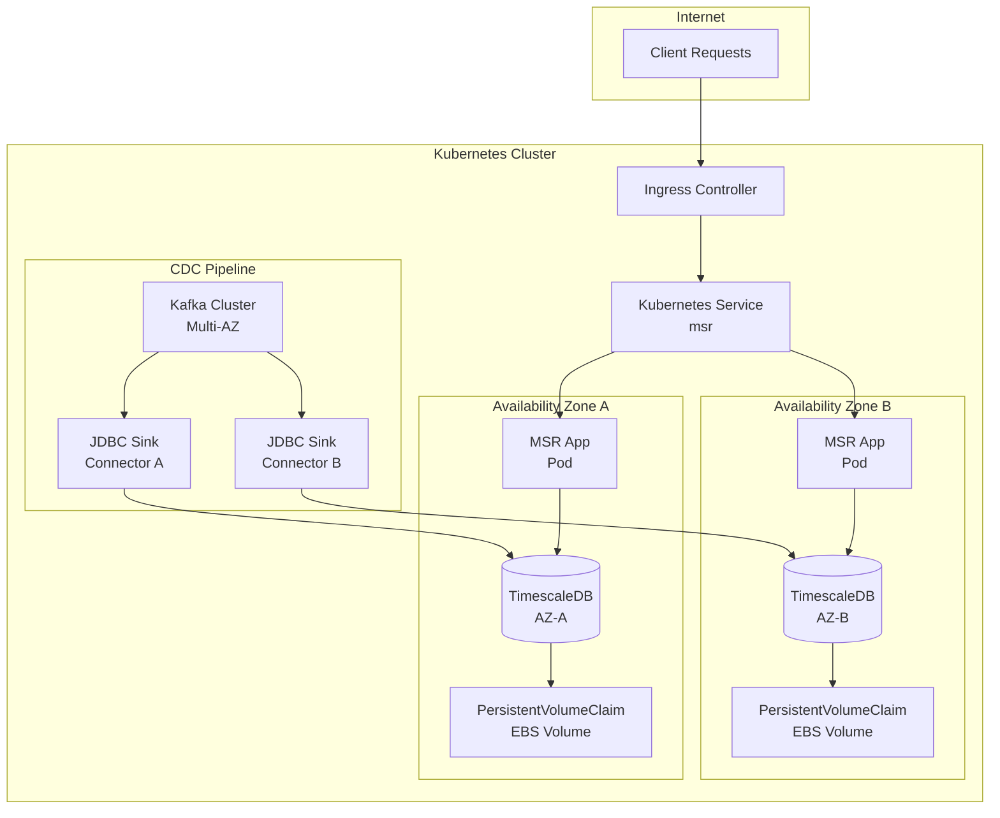
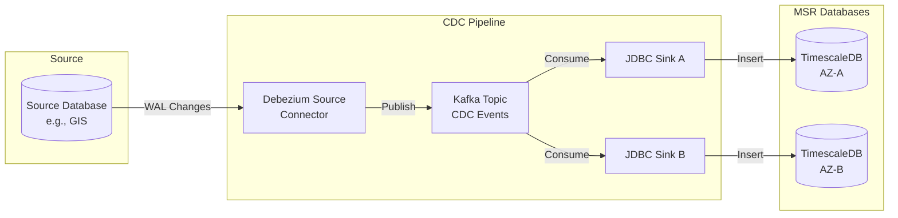
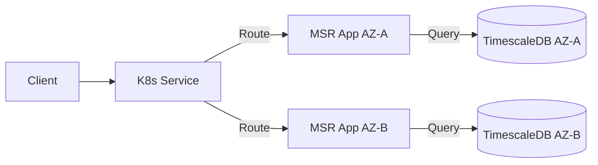
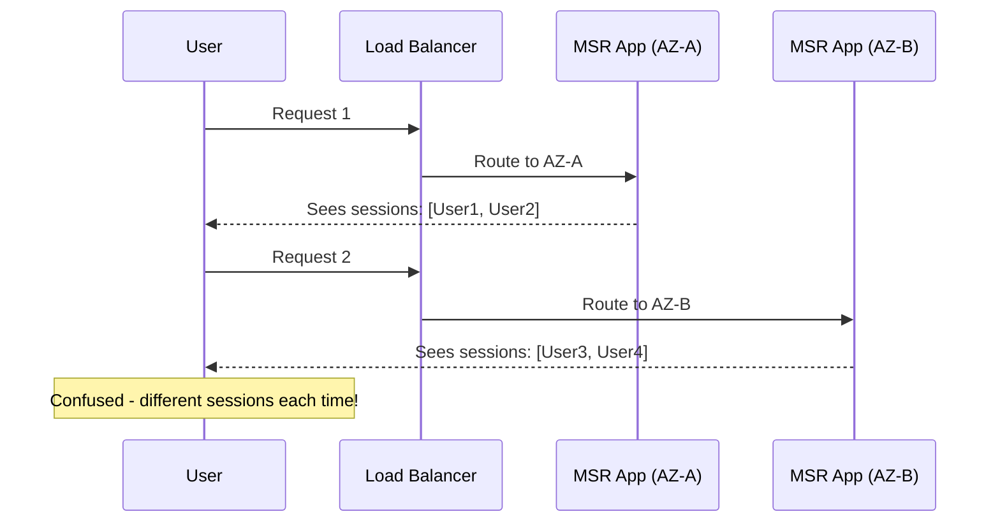
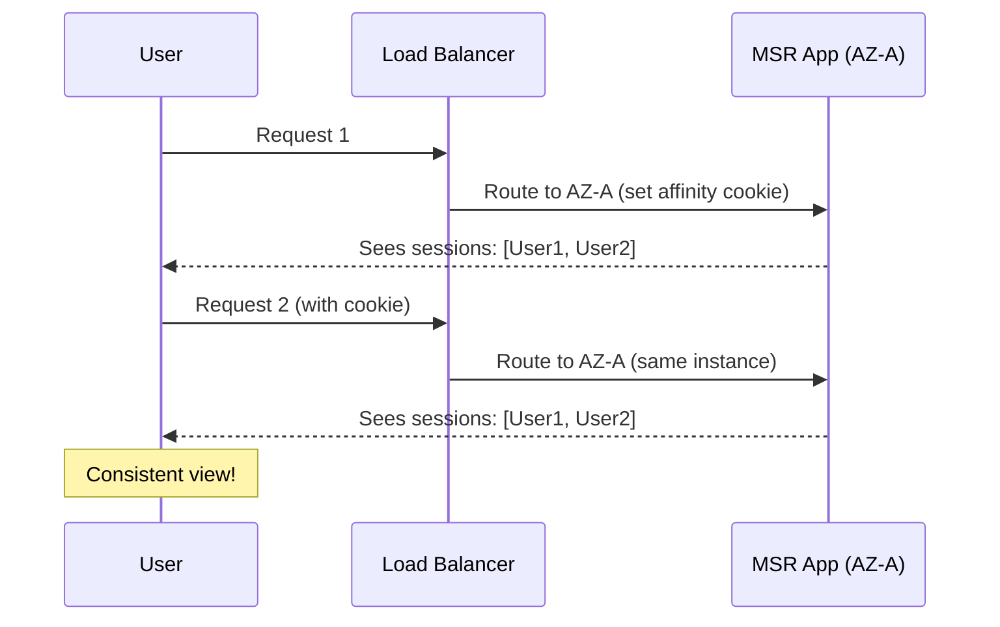

# Cross-AZ High Availability Architecture

This page describes the architecture of the Kafka Connect Dual Writing approach for MSR high availability across multiple Availability Zones.

## Architecture Overview

The architecture deploys MSR components across two Availability Zones with the following characteristics:

- **MSR App instances** in each AZ connect to their **local TimescaleDB** instance
- **Kubernetes Service** load-balances traffic across both MSR App instances
- **Sticky sessions** ensure users consistently connect to the same AZ
- **JDBC Sink Connectors** write CDC events to both databases independently
- **Kafka** serves as the durable source of truth for CDC events



## Component Responsibilities

### Ingress Controller

Routes external traffic to the MSR Kubernetes Service. The specific ingress controller (Traefik, NGINX, AWS ALB) depends on your cluster configuration.

### Kubernetes Service

The MSR Service uses a label selector that matches MSR App pods in both AZs:

```yaml
selector:
  app: msr  # Matches pods in both AZ-A and AZ-B
```

Kubernetes automatically load-balances requests across all matching pods. When pods in one AZ become unavailable, traffic automatically routes to the remaining healthy pods.

### MSR App (Per AZ)

Each AZ runs an MSR App deployment with:

- **Node Affinity**: Ensures the pod schedules only on nodes in its designated AZ
- **Local Database Connection**: Connects to the TimescaleDB instance in the same AZ
- **Common Label**: Uses `app: msr` so the Service can route to both deployments

### TimescaleDB (Per AZ)

Each AZ has an independent TimescaleDB instance:

- **Node Affinity**: Pinned to its designated AZ
- **Persistent Storage**: Uses a PersistentVolumeClaim bound to an EBS volume in the same AZ
- **Dedicated Service**: Has its own ClusterIP Service for the local MSR App to connect

### JDBC Sink Connectors

Two JDBC Sink Connectors run in Kafka Connect:

| Connector | Target Database | Purpose |
|-----------|-----------------|---------|
| `cdc-sink-connector-az-a` | TimescaleDB AZ-A | Writes CDC events to AZ-A database |
| `cdc-sink-connector-az-b` | TimescaleDB AZ-B | Writes CDC events to AZ-B database |

Both connectors consume from the same Kafka topic(s), ensuring both databases receive identical CDC events.

## Data Flow

### Write Path (CDC Events)

CDC events flow from source databases to both MSR TimescaleDB instances:



### Read Path (API Requests)

User requests are load-balanced across MSR App instances, each reading from its local database:



## Failure Scenarios

### Single Node Failure

If a node running MSR App or TimescaleDB fails:

1. Kubernetes detects the pod is unhealthy
2. For MSR App: Service stops routing to the failed pod; traffic goes to the other AZ
3. For TimescaleDB: The pod reschedules on another node in the same AZ (if available)

### AZ Failure

If an entire AZ becomes unavailable:

1. All pods in that AZ become unreachable
2. Kubernetes Service routes all traffic to the surviving AZ
3. CDC events continue flowing to the surviving database via its sink connector
4. The affected AZ's sink connector queues events in Kafka until recovery

### Kafka Connect Failure

If a JDBC Sink Connector fails:

1. Events queue in the Kafka topic (retained based on topic configuration)
2. The affected database stops receiving new CDC events
3. Once the connector recovers, it resumes from its last committed offset
4. No data loss occurs as long as Kafka retention exceeds the outage duration

## Design Considerations

### Why Local Database Connections?

Each MSR App connects to a database in its own AZ to:

- **Minimize latency**: No cross-AZ database queries
- **Reduce failure blast radius**: AZ-A failure doesn't affect AZ-B's database connectivity
- **Simplify recovery**: Each AZ operates independently

### Why Dual Sink Connectors?

Using separate sink connectors (instead of database replication) provides:

- **Independence**: No coordination between databases
- **Kafka as source of truth**: Both databases derive state from the same immutable event log
- **Flexible recovery**: Can rebuild either database from Kafka if needed

### Data Consistency

Both databases are **eventually consistent**:

- Kafka's ordering guarantees ensure events arrive in the same order
- Minor lag differences may exist between connectors
- For MSR's use case (historical replay), this is acceptable

### Why Sticky Sessions?

MSR includes a **session management** feature that limits concurrent API users per instance. Each MSR App maintains its own session list in its local database—these sessions are intentionally **not synchronized** between AZs because:

- Session limits are based on instance capacity
- Two instances means twice the capacity, so each can manage its own user sessions
- This allows the system to scale horizontally

**The Problem with Round-Robin Load Balancing**

Without sticky sessions, users may be routed to different AZs on each request:



This creates a confusing experience for administrators managing sessions, as they see different session lists depending on which AZ handles their request.

**The Solution: Session Affinity**

Sticky sessions ensure a user's requests consistently route to the same AZ:



If an AZ fails, affected users simply reconnect and are assigned to the surviving AZ, where they establish a new session.

:::tip Recommended Configuration
Configure sticky sessions at the ingress level. See the [Implementation Guide](./implementation) for ingress annotation examples.
:::
