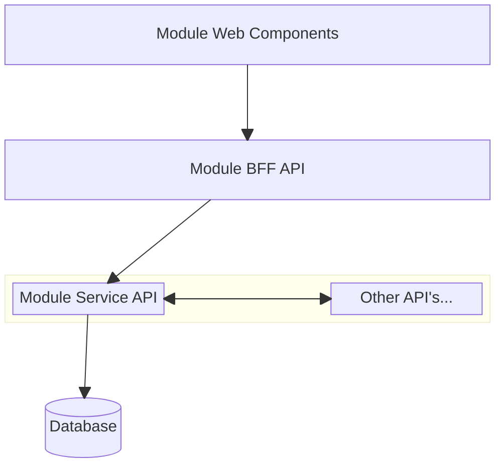
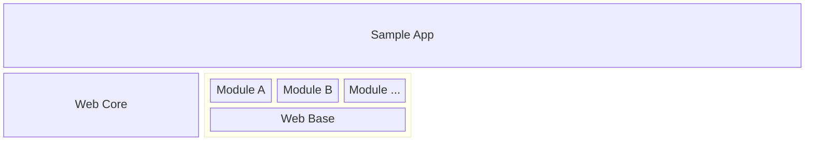

# Packaging Strategy

Components in AGIL Ops Hub are split up into `modules`. Modules may or may not have dependencies on other modules,
depending on how complex they are. If the intent is to only use the modules for their backend API's, the web
section can be ignored, however, most modules will also typically come with some packaged UI components that can
either be used out-of-the-box as is, or as a kickstarter for further development.

## Typical Structure of Module Components

This results in a few types of packages that might built for each module

1. `Container Images`: in a production environment, this would typically be deployed by a container orchestrator such as
   Kubernetes. In development environments, it is up to projects to decide how they will work, but this would typically
   be via running Docker compose / swarm or a locak k3s cluster.
2. `Web Libraries`: these libraries might contain ready-to-use components or pages specific to the module
3. `Deployment Files`: these would be Kubernetes helm charts to facilitate adapting the modules to projects'
   infrastructural needs

## Application Structure / Release Artifacts

-   The `Web Base` is a template repository, containing the minimum components required by all modules with a front-end.
    This includes the authentication framework, as well as other basic commonly needed web components such as menu items for
    navigation, and themes.

-   The `Web Core` is a set of libraries that each modules' web libraries would depend on to ensure they function within
    the web framework/base.

-   `Module...` comprises of each modules' `Container Images`, `Web Libraries` and `Deployment Files`.

-   The `Sample App` is a reference architecture that projects can refer to on how to use all the modules together,
    this is not a release artifact for them to use, they would start with the `Web Base` and add `Modules` in as desired,
    however, the `Sample App` exists as an integration and test environment to validate all the modules can work together
    cohesively.
