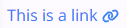

# Link

Modal allows the user to create a page infront as well as deactivates all other contents.


## Usage

```sv title="MyPage/+page.svelte"
<script lang="ts">
    import Link from '$lib/components/basic/Modal/index.svelte'
</script>

<div class="p-4 flex gap-2">
    <Modal widthClass="w-96" heightClass="h-32" >
        <!-- Insert page content here -->
        <div class="">This is my content</div>
    
    </Modal>
</div>

```

### Active



## Parameter

| Option        | Type   | Description                                                         |
| ------------- | ------ | ------------------------------------------------------------------- |
| `href`        | string | The hyperlink the user will be routed to if Link is clicked         |
| `appendClass` | string | Extra styling properties top be added to the current Link component |
