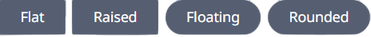

## Summary



A Button is a component that allows you to add standard html buttons to your project with certain customizability.

### Usage

```sv title="MyPage/+page.svelte"
<script lang="ts">
    import Button from '$lib/components/basic/Button/index.svelte'
</script>

<div class="">
    <Button appendClass="w-24 h-12 flex overflow-">Click me</Button>
</div>

<Button/>
```

## Value

## Parameters
