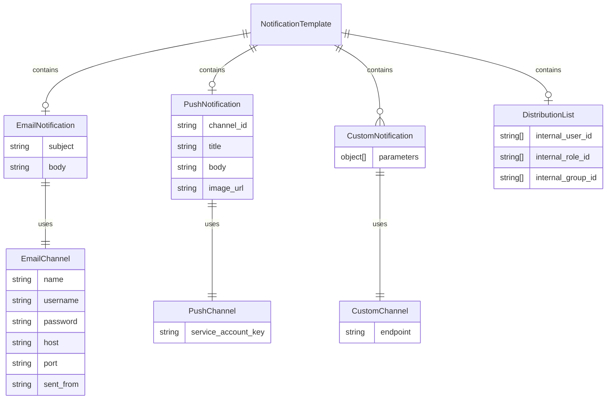

import IdealImage from "@theme/IdealImage";
import concept from "@site/static/img/modules/unh/overview/concept-diagram.png";

# Operating Concepts

## Concept Diagram

    

        <IdealImage img={concept} />
    

## Domain Model

## Entity Descriptions

The domain model of UNH revolves around the following key entities:
1. **Notification Template** - A notification template is composed of several notification types and a distribution
list.
2. **Email Notification** - An email notification uses the email channel (SMTP server) to send email notifications to
recipients' email addresses.
3. **Push Notification** - A push notification uses the push channel (FCM) to send push notifications to recipients'
mobile devices.
4. **Custom Notification** - A custom notification uses a developer-defined custom channel, allowing for customized
delivery methods and channel-specific parameters.
5. **Distribution List** - A list of recipients based on IAMS users, roles, or groups, used to send notifications to
multiple users at once.
6. **Email Channel** - The email channel uses SMTP to send email notifications to recipients' email addresses.
7. **Push Channel** - The push channel uses FCM to send push notifications to recipients' mobile devices.
8. **Custom Channel** - The custom channel allows for customized delivery methods and channel-specific parameters.
