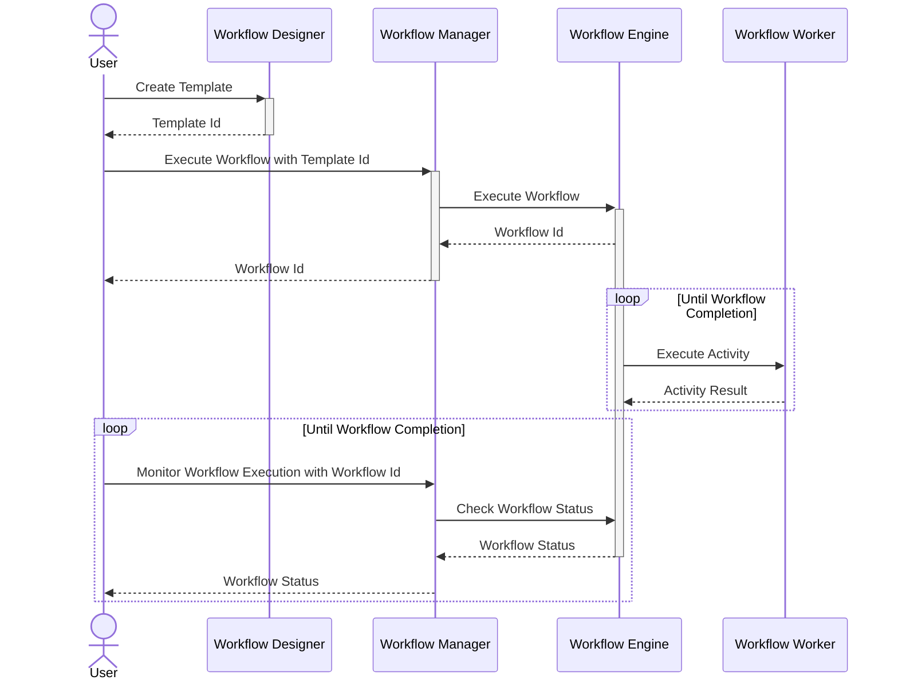

# Operating Concepts
At its core, Workflow Engine uses [Temporal](https://temporal.io) to orchestrate the business process model as per
[BPMN 2.0 spec](https://www.omg.org/spec/BPMN/2.0/About-BPMN).

## Components
The Workflow Engine is composed of the following key components:

-   **Workflow Engine (WFE)** - The core Engine responsible for orchestrating workflows and executing activities.
-   **Workflow Manager (WFM)** - Provides APIs to create and manage workflow templates and executions.
-   **Workflow Worker (WFW)** - A ready-to-use generic activity worker service.
-   **Workflow Designer (WFD)** - A Web application for creating and editing workflow templates.

## Domain Model
The domain model of Workflow Engine has following key entities:
1. **Workflow Template** - A workflow template is a definition of a business process. It is represented as a BPMN
diagram.
2. **Workflow** - A workflow is a running instance of a workflow template.
3. **Activity** - An activity is a unit of work that is executed by a workflow.

## Sequence Diagram

