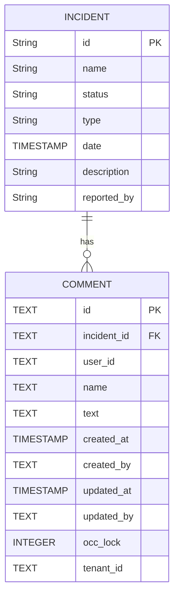

# Comments

| Attribute   | Type | Description                                               |
| ----------- | ---- | --------------------------------------------------------- |
| id          | TEXT | Unique identifier for the comment.                        |
| incident_id | TEXT | Foreign key referencing the `incident` table.             |
| user_id     | TEXT | Foreign key referencing the `user` table.                 |
| name        | TEXT | Name or display name of the user who created the comment. |
| text        | TEXT | The actual text content of the comment.                   |
| created_at | TIMESTAMP WITH TIME ZONE | Timestamp of when the comment was created. |
| created_by | TEXT | User ID of the user who created the comment. |
| updated_at | TIMESTAMP WITH TIME ZONE | Timestamp of the last update to the comment. |
| updated_by | TEXT | User ID of the user who last updated the comment. |
| occ_lock | INTEGER | Optimistic locking field to prevent data inconsistencies. |
| tenant_id | TEXT | Identifier for the tenant or organization to which the comment belongs. |

Incident comments are textual notes or updates added to an incident record within an incident management system. They serve as a running log or conversation thread related to the specific incident. Users are able to attach them onto incidents to append real time updates to it.
